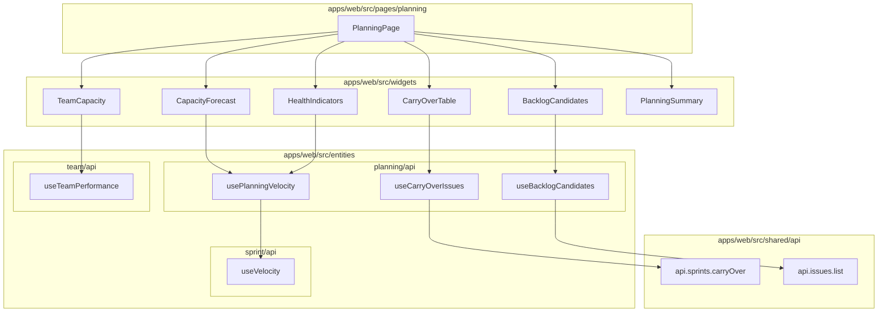

# ADR: Planing Page

**Issue:** [STA-14](linear://issue/STA-14)  
**Date:** 2026-03-30  
**Status:** Draft

---

# Architecture Plan: STA-14 — Planning Page

## Context

Sprint planning currently requires navigating across Dashboard, Sprints, and Team pages to gather velocity, carry-over, and capacity data. This fragmentation leads to over-commitment because planners cannot see aggregated forecast, historical health metrics, and backlog candidates in a single view.

The codebase follows Feature-Sliced Design (FSD). Pages like `SprintsPage` (see: apps/web/src/pages/sprints/ui/index.tsx:1-45) demonstrate the pattern: import from `@/entities/*` for data hooks, `@/widgets/*` for composed UI blocks, and `@/shared/ui` for primitives. The `useProjectStore` pattern (see: apps/web/src/pages/sprints/ui/index.tsx:12-13) handles project selection with a standard "Select a project" fallback.

Existing API infrastructure supports the needed data:
- `useVelocity` returns `VelocityPoint[]` with `completedSp` per sprint (see: apps/web/src/entities/sprint/api/index.ts:31-37)
- `useTeamPerformance` returns `AssigneePerformance` with per-member metrics (see: apps/web/src/entities/team/api/index.ts:6-12)
- `sprintStatsSchema` already defines `committedSp`, `addedSp`, `carryOverSp`, `completedSp` (see: packages/shared/src/schemas/sprint.schema.ts:25-35)
- `issueSchema` has `flowPhase`, `storyPoints`, `sprintIds` for filtering carry-over and backlog (see: packages/shared/src/schemas/issue.schema.ts:7-36)

Charts use visx (see: apps/web/src/widgets/sprint-velocity/ui/index.tsx:9-10), with established patterns for bar charts, tooltips, and responsive containers.

## Decision Drivers

- **Consistency**: Must follow existing FSD layering — no cross-slice imports, widgets compose entities
- **Parallel loading**: AC requires 4 parallel requests with per-section loading states
- **Performance**: Summary bar must re-render within 200ms on checkbox toggle — requires local state, no network
- **Reuse**: Existing hooks (`useVelocity`, `useTeamPerformance`, `useIssues`) cover ~60% of data needs
- **Type safety**: Shared schemas ensure API contract alignment between frontend and backend

## Considered Options

### Option 1: Extend existing entity hooks + new planning-specific hooks

Reuse `useVelocity` and `useTeamPerformance` directly. Add two new hooks: `useLastSprintCarryOver` (issues with `flowPhase !== 'done'` from last closed sprint) and `useBacklogCandidates` (issues without active/future sprint). Compute P25/median/P75 and health indicators client-side from velocity data.

- **Pros**: Minimal new API endpoints; leverages proven hooks; client-side calculation is fast for 6 sprints
- **Cons**: Requires filtering closed sprints client-side; carry-over query needs new endpoint regardless
- **Effort**: ~40h

### Option 2: Dedicated `/api/planning` aggregate endpoint

Single backend endpoint returns all planning data (forecast, carry-over, team capacity, health, backlog). Frontend calls one endpoint.

- **Pros**: Single network request; backend handles all aggregation
- **Cons**: Violates existing API granularity pattern (see: apps/web/src/shared/api/index.ts:20-75 — each resource has separate endpoints); harder to show per-section loading; backend coupling increases
- **Effort**: ~50h

### Option 3: Thin planning hooks wrapping existing + 2 new endpoints

Create `entities/planning/api` with hooks that:
1. Call existing `useVelocity` with `limit=6, state=closed`
2. Call existing `useTeamPerformance`
3. Add `GET /sprints/:id/carry-over` for incomplete issues
4. Add `GET /issues?backlog=true` filter for unassigned-to-sprint issues

Forecast calculation (percentiles) and health indicators computed client-side in dedicated components.

- **Pros**: Follows existing API patterns; enables parallel loading per AC; minimal backend changes; clear separation
- **Cons**: 4 parallel requests (acceptable per AC "Happy path")
- **Effort**: ~44h

## Decision

**We will use Option 3: Thin planning hooks wrapping existing + 2 new endpoints**

This aligns with the established API pattern where resources have focused endpoints (see: apps/web/src/shared/api/index.ts:20-50 — issues, sprints, dashboard each have dedicated methods). The existing `useVelocity` already returns velocity points with `completedSp` (see: apps/web/src/entities/sprint/api/index.ts:31-37), and `useTeamPerformance` provides `avgSpPerSprint` and cycle time (see: apps/web/src/entities/team/api/index.ts:6-12).

Client-side percentile calculation for 6 data points is negligible (<1ms). Health indicator sparklines reuse the visx patterns established in `sprint-velocity` (see: apps/web/src/widgets/sprint-velocity/ui/index.tsx:9-10).

### Architecture Diagram



### File Structure

```
apps/web/src/
├── entities/planning/
│   ├── api/
│   │   └── index.ts              # usePlanningVelocity, useCarryOverIssues, useBacklogCandidates
│   ├── lib/
│   │   └── percentiles.ts        # computePercentiles(values, [25, 50, 75])
│   └── index.ts
├── widgets/
│   ├── capacity-forecast/ui/index.tsx
│   ├── carry-over-table/ui/index.tsx
│   ├── team-capacity/ui/index.tsx
│   ├── health-indicators/ui/index.tsx
│   ├── backlog-candidates/ui/index.tsx
│   └── planning-summary/ui/index.tsx
├── pages/planning/
│   ├── ui/index.tsx
│   └── index.ts
└── shared/api/index.ts           # Add api.sprints.carryOver

packages/shared/src/schemas/
└── planning.schema.ts            # CapacityForecast, HealthIndicator types
```

### State Management

Selection state (carry-over checkboxes, backlog checkboxes) stays local in `PlanningPage` using `useState<Set<string>>`. Both `CarryOverTable` and `BacklogCandidates` receive `selectedKeys` and `onToggle` props. `PlanningSummary` computes totals from these sets + issue SP data — no network calls on toggle, ensuring <200ms re-render per AC.

```typescript
// PlanningPage local state
const [selectedCarryOver, setSelectedCarryOver] = useState<Set<string>>(new Set());
const [selectedBacklog, setSelectedBacklog] = useState<Set<string>>(new Set());

// Derived computation (memoized)
const totalSp = useMemo(() => {
  const carryOverSp = carryOverIssues
    .filter(i => selectedCarryOver.has(i.key))
    .reduce((sum, i) => sum + (i.storyPoints ?? 0), 0);
  const backlogSp = backlogIssues
    .filter(i => selectedBacklog.has(i.key))
    .reduce((sum, i) => sum + (i.storyPoints ?? 0), 0);
  return carryOverSp + backlogSp;
}, [carryOverIssues, backlogIssues, selectedCarryOver, selectedBacklog]);
```

## Consequences

### Positive

- **Parallel loading**: Each section has independent loading state matching existing patterns (see: apps/web/src/pages/sprints/ui/index.tsx:15 — `isLoading` per query)
- **Reuse**: 60% of data fetching uses existing proven hooks
- **Testability**: `computePercentiles` is pure function; widgets receive data via props
- **Consistency**: Follows FSD structure and visx chart patterns already in codebase

### Negative / Trade-offs

- **4 parallel requests**: Acceptable per AC but adds slight complexity vs single aggregate endpoint
- **Client-side computation**: Health indicator trends computed in browser — negligible for 6 points but adds ~50 lines of code
- **New entity slice**: `entities/planning` adds a slice, but keeps planning logic isolated from sprint/team entities

### Risks

| Severity | Risk | Mitigation |
|----------|------|------------|
| Medium | Backlog query returns large dataset (1000+ issues) degrading UI | Implement server-side pagination via existing `PaginatedResponse` pattern (see: apps/web/src/shared/api/index.ts:16-21); AC already specifies 20 items/page |
| Medium | Percentile calculation edge cases (< 3 sprints) produce misleading forecasts | AC specifies "Low confidence" warning; add explicit guard in `CapacityForecast` showing only mean |
| Low | Sticky summary bar occludes content on small screens | Use `position: sticky` with `bottom: 0` + add padding to page content; test at 768px breakpoint |