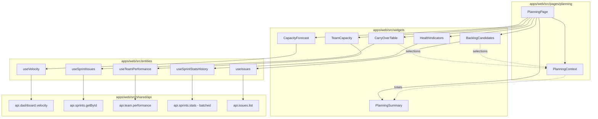

# ADR: Planing Page

**Issue:** [STA-15](linear://issue/STA-15)  
**Date:** 2026-03-30  
**Status:** Draft

---

# Architecture Plan: STA-15 — Planning Page

## Context

Sprint planning is fragmented across Dashboard, Sprints, and Team pages, leading to over-commitment due to lack of aggregated capacity/velocity data. The task requires a new `/planning` route consolidating: velocity-based forecast (P25/median/P75), carry-over from last sprint, team capacity metrics, health indicators with sparklines, backlog candidates, and a sticky summary bar with real-time SP totals.

The codebase follows Feature-Sliced Design (FSD) with pages in `apps/web/src/pages/{name}/ui/index.tsx` (see: apps/web/src/pages/team/ui/index.tsx:1-24). Widgets are isolated in `apps/web/src/widgets/{name}/` (see: apps/web/src/widgets/sprint-velocity-detailed/ui/index.tsx:1-50). API hooks follow the pattern in `apps/web/src/entities/{domain}/api/index.ts` using TanStack Query (see: apps/web/src/entities/sprint/api/index.ts:1-37).

Existing data sources partially cover requirements:
- `useVelocity` provides sprint velocity points (see: apps/web/src/entities/sprint/api/index.ts:31-37)
- `useTeamPerformance` returns assignee metrics including `avgSpPerSprint` (see: apps/web/src/entities/team/api/index.ts:6-12)
- `useIssues` supports filtering by project/sprint (see: apps/web/src/entities/issue/api/index.ts:5-10)
- `sprintStatsSchema` contains `committedSp`, `addedSp`, `carryOverSp`, `completedSp` needed for health indicators (see: packages/shared/src/schemas/sprint.schema.ts:22-32)

Charts use `@visx/xychart` consistently (see: apps/web/src/widgets/sprint-velocity-detailed/ui/index.tsx:14-17). Project context is managed via `useProjectStore` with the same "no project selected" pattern across pages (see: apps/web/src/pages/team/ui/index.tsx:6,14-16).

## Decision Drivers

- **Consistency**: Must follow established FSD structure, API hook patterns, and widget composition
- **Performance**: 4 parallel queries with per-section loading states; 200ms re-render for checkbox toggles
- **Reusability**: Existing hooks (`useVelocity`, `useTeamPerformance`, `useIssues`) should be leveraged; new hooks only for missing data
- **Calculation location**: Percentiles and aggregations can be computed client-side given small dataset (6 sprints max)
- **State isolation**: Checkbox selections are local UI state (no persistence needed per AC)

## Considered Options

### Option 1: Monolithic Page with Inline Sections

- Single `PlanningPage` component containing all 6 sections inline
- All state and calculations in one component
- **Pros**: Simple initial implementation, no prop drilling
- **Cons**: Violates FSD widget separation; 500+ line component; poor testability; harder parallel development
- **Effort**: ~35h

### Option 2: Widget-per-Section with Shared Context (Recommended)

- Create `apps/web/src/pages/planning/ui/index.tsx` as orchestrator
- One widget per AC section: `CapacityForecast`, `CarryOverTable`, `TeamCapacity`, `HealthIndicators`, `BacklogCandidates`, `PlanningSummary`
- Shared selection state via React Context at page level
- New API hooks only where existing ones insufficient
- **Pros**: Follows existing widget pattern (see: apps/web/src/pages/sprints/ui/index.tsx:8-10); parallel development; isolated testing; consistent with codebase
- **Cons**: Requires context setup for cross-widget state
- **Effort**: ~46h

### Option 3: Widget-per-Section with Zustand Store

- Same widget decomposition as Option 2
- Dedicated `usePlanningStore` for checkbox selections and computed totals
- **Pros**: Familiar pattern from `useProjectStore` (see: apps/web/src/entities/project/model/index.ts:1-20); devtools support
- **Cons**: Overkill for ephemeral UI state; no persistence needed; adds store boilerplate
- **Effort**: ~50h

## Decision

**We will use Option 2: Widget-per-Section with Shared Context**

This aligns with the established widget composition pattern visible in `SprintsPage` which composes `SprintBurndown`, `SprintScopeTable`, `SprintStats`, `SprintVelocityDetailed` (see: apps/web/src/pages/sprints/ui/index.tsx:8-10). The React Context approach is appropriate because:

1. Checkbox state is ephemeral (resets on navigation) — no persistence needed unlike project selection
2. State flows one-way: CarryOverTable/BacklogCandidates → PlanningSummary
3. Context scope is naturally bounded to the Planning page

Client-side percentile calculation is justified: velocity array is max 6 points, P25/median/P75 is O(n log n) sort + O(1) index access — negligible overhead vs. adding backend endpoint.



## File Structure

```
apps/web/src/
├── pages/planning/
│   ├── ui/
│   │   └── index.tsx              # Page orchestrator
│   ├── model/
│   │   └── planning-context.tsx   # Selection state context
│   └── index.ts                   # Public exports
├── widgets/
│   ├── capacity-forecast/ui/index.tsx
│   ├── carry-over-table/ui/index.tsx
│   ├── team-capacity/ui/index.tsx
│   ├── health-indicators/ui/index.tsx
│   ├── backlog-candidates/ui/index.tsx
│   └── planning-summary/ui/index.tsx
├── entities/sprint/api/index.ts   # Add useSprintStatsHistory
├── features/planning/             # Percentile calculation utils
│   └── lib/
│       └── percentiles.ts
├── app/
│   ├── router.tsx                 # Add /planning route
│   └── layout.tsx                 # Add sidebar item
└── shared/ui/icons/
    └── PlanningIcon.tsx           # New icon for sidebar
```

## API Layer Strategy

| Data Need | Existing Hook | Action |
|-----------|---------------|--------|
| Velocity (6 sprints) | `useVelocity` (see: sprint/api/index.ts:31) | Reuse with `limit=6, state=closed` params |
| Last sprint issues | `useSprint` returns `issues[]` (see: shared/api/index.ts:44) | Reuse, filter client-side by `flowPhase !== 'done'` |
| Team performance | `useTeamPerformance` (see: team/api/index.ts:6) | Reuse directly |
| Health indicators (6 sprints) | None — need stats for multiple sprints | Add `useSprintStatsHistory` hook, batch 6 `stats()` calls via `Promise.all` |
| Backlog candidates | `useIssues` (see: issue/api/index.ts:5) | Reuse with `sprintId=none` filter, add pagination params |

## Consequences

### Positive

- Follows FSD conventions — maintainable by team (see ownership: Konstantin Shchegolev owns all relevant files)
- Widgets are independently testable and developable in parallel
- Reuses 4 of 5 required data sources — minimal API surface increase
- Client-side percentiles avoid backend changes for statistical calculations
- 200ms re-render budget easily met: context update → single summary recalc

### Negative / Trade-offs

- Context adds ~50 lines of boilerplate vs. prop drilling
- Health indicators require 6 sequential-then-batched API calls (stats endpoint is per-sprint)
- Backlog pagination requires client to track page state

### Risks

| Severity | Risk | Mitigation |
|----------|------|------------|
| Medium | Health indicators batch (6 calls) may be slow | Implement `Promise.all` with individual section skeletons; consider backend aggregation endpoint in future iteration |
| Low | Backlog could be large (1000+ issues) | Already mitigated by AC: 20-item pagination + server-side filtering |
| Low | <3 sprints edge case untested | AC explicitly defines behavior: show warning + average only; add unit test for `calculatePercentiles` with n<3 |