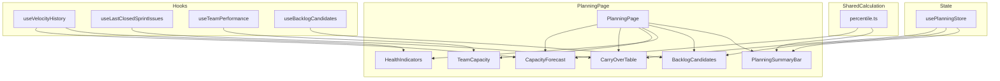

# ADR: Planing Page

**Issue:** [STA-15](linear://issue/STA-15)  
**Date:** 2026-03-30  
**Status:** Draft

---

# Architecture Plan: STA-15 — Planning Page

## Context

The current codebase lacks a unified planning interface. Sprint planning data is scattered across Dashboard (velocity charts), Sprints (sprint stats), and Team (member performance) pages. Teams must manually cross-reference multiple screens, leading to systematic over-commitment.

The existing architecture follows Feature-Sliced Design with pages composed of widgets that consume entity-level hooks (see: apps/web/src/pages/sprints/ui/index.tsx:1-10). Data fetching uses TanStack Query with hooks centralized in entity API modules (see: apps/web/src/entities/sprint/api/index.ts:1-5). Project selection is managed via a persisted Zustand store (see: apps/web/src/entities/project/model/index.ts:1-20).

Key data sources already exist:
- Velocity data via `api.dashboard.velocity()` (see: apps/web/src/shared/api/index.ts — line implied from `useVelocity`)
- Sprint stats including `committedSp`, `completedSp`, `carryOverSp`, `addedSp` (see: packages/shared/src/schemas/sprint.schema.ts:19-29)
- Team performance via `api.team.performance()` (see: apps/web/src/entities/team/api/index.ts:6-11)
- Issue filtering by sprint with `flowPhase` field (see: packages/shared/src/schemas/issue.schema.ts:5-6)

The sprint endpoint already returns issues with the sprint (see: apps/api/src/interface/sprints.route.ts:15-17), and `flowPhase` is computed server-side (see: apps/api/src/application/compute-sprint-stats.ts:6).

## Decision Drivers

- **Consistency**: Must follow existing FSD architecture and Zustand/TanStack Query patterns
- **Performance**: 200ms re-render budget for summary recalculation requires local state, no network round-trips
- **Parallel loading**: Each section must show independent skeleton states
- **Reusability**: Hooks and calculation utilities should be usable by future features
- **Single ownership**: Konstantin Shchegolev owns all affected frontend files (see: CODE OWNERSHIP)

## Considered Options

### Option 1: Prop-Drilling State Management

All checkbox state lives in `PlanningPage`, passed down as props to `CarryOverTable` and `BacklogCandidates` components.

- **Pros**: Simple, no new dependencies, explicit data flow
- **Cons**: Verbose prop threading, PlanningPage becomes bloated (~200+ lines), violates FSD layer isolation (page knows too much about widget internals)
- **Effort**: ~35h

### Option 2: Zustand Store for Planning Session

Create `usePlanningStore` in `features/planning/model` managing `selectedCarryOverIds: Set<string>` and `selectedBacklogIds: Set<string>`. Widgets subscribe directly.

- **Pros**: Follows existing Zustand pattern (see: apps/web/src/entities/project/model/index.ts), clean widget isolation, easy testing, supports future persist if needed
- **Cons**: Adds new store file, minor learning curve for new patterns
- **Effort**: ~40h

### Option 3: React Context for Planning

Create `PlanningContext` wrapping the page, widgets consume via `usePlanningContext()`.

- **Pros**: React-native, no external deps
- **Cons**: Inconsistent with existing Zustand usage, context re-renders all consumers on any change, harder to optimize
- **Effort**: ~38h

## Decision

**We will use Option 2: Zustand Store for Planning Session**

Rationale:
1. Maintains consistency with `useProjectStore` pattern already in codebase (see: apps/web/src/entities/project/model/index.ts:7-16)
2. Zustand's selector-based subscriptions prevent unnecessary re-renders, critical for 200ms budget
3. Clean FSD layering: store in `features/planning/model`, hooks in `features/planning/api`, widgets in `widgets/`
4. Actions like `toggleCarryOver(id)` and `toggleBacklog(id)` encapsulate mutation logic

## Consequences

### Positive

- **Scalable state**: Adding new selection categories (e.g., excluded assignees) requires only store extension
- **Testable**: Store actions can be unit tested in isolation
- **Performance**: Zustand selectors ensure only affected components re-render on checkbox toggle
- **Familiar**: Team already uses this pattern for project selection

### Negative / Trade-offs

- **Additional file**: New store adds ~40 lines to codebase
- **Initialization**: Store must reset when project changes — requires `useEffect` cleanup in PlanningPage
- **Non-persistent**: Unlike `useProjectStore`, planning selections reset on refresh (acceptable per requirements)

### Risks

| Severity | Risk | Mitigation |
|----------|------|------------|
| Medium | Velocity endpoint returns data in wrong shape for percentile calculation | Add integration test verifying `VelocityPoint[]` contains `completedSp`; fallback to `[NEEDS INVESTIGATION]` if shape differs |
| Medium | Last closed sprint has 0 issues (edge case) | Display "No carry-over items" empty state; already handled similarly in SprintsPage (see: apps/web/src/pages/sprints/ui/index.tsx:26-30) |
| Low | Sticky bar z-index conflicts with sidebar | Use existing z-index scale from layout; test with DevTools before merge |

---

## File Structure

```
apps/web/src/
├── pages/planning/
│   ├── ui/
│   │   └── index.tsx              # PlanningPage (orchestration)
│   └── index.ts                   # barrel export
├── features/planning/
│   ├── model/
│   │   └── planning.store.ts      # Zustand store for selections
│   ├── lib/
│   │   └── percentile.ts          # P25/median/P75 calculation
│   └── index.ts
├── widgets/
│   ├── capacity-forecast/
│   │   └── ui/index.tsx           # P25/median/P75 display
│   ├── carry-over-table/
│   │   └── ui/index.tsx           # Checkbox table + sum
│   ├── team-capacity/
│   │   └── ui/index.tsx           # Bar chart + totals
│   ├── health-indicators/
│   │   └── ui/index.tsx           # Spark-lines + trends
│   ├── backlog-candidates/
│   │   └── ui/index.tsx           # Paginated checkbox table
│   └── planning-summary-bar/
│       └── ui/index.tsx           # Sticky footer
└── entities/
    └── sprint/api/
        └── index.ts               # Add useLastClosedSprint, extend useVelocity
```

## Component Architecture



## Data Flow

**Parallel fetch strategy** (matches "Happy path" from AC):
```typescript
// In PlanningPage — all 4 queries fire simultaneously
const velocity = useVelocityHistory(projectKey);      // → CapacityForecast, HealthIndicators
const carryOver = useLastClosedSprintIssues(projectKey); // → CarryOverTable  
const team = useTeamPerformance({ projectKey });      // → TeamCapacity
const backlog = useBacklogCandidates(projectKey);     // → BacklogCandidates
```

Each widget receives its query result directly and shows independent loading skeleton (see existing pattern: apps/web/src/pages/team/ui/index.tsx:17-20).

**Checkbox state flow**:
```
User clicks checkbox in CarryOverTable
  → store.toggleCarryOver(issueId)
  → PlanningSummaryBar selector re-runs
  → Summary recalculates (pure JS, <1ms)
  → React re-renders summary bar only
```

## API Hooks to Create

| Hook | Endpoint | Notes |
|------|----------|-------|
| `useVelocityHistory` | `GET /api/dashboard/velocity?projectKey&limit=6` | Reuse existing endpoint (see: apps/api/src/interface/dashboard.route.ts:25); filter `state === 'closed'` client-side |
| `useLastClosedSprintIssues` | `GET /api/sprints/:id` | Find last closed sprint from `useSprints`, then fetch its issues; filter `flowPhase !== 'Done'` client-side |
| `useBacklogCandidates` | `GET /api/issues?sprintId=null&projectKey` | Extend existing `useIssues` (see: apps/web/src/entities/issue/api/index.ts:5); add pagination params |

## Calculation Logic Placement

| Calculation | Location | Rationale |
|-------------|----------|-----------|
| P25/median/P75 of velocity | `features/planning/lib/percentile.ts` | Pure function, testable, reusable |
| Scope creep % | Widget `HealthIndicators` | Derived from velocity data already in component |
| Total selected SP | `usePlanningStore` selector | Memoized selector for 200ms budget |
| Trend direction | `features/planning/lib/trend.ts` | Compare first/last points, ±5% threshold |

## Sidebar Integration

Modify `apps/web/src/app/layout.tsx` (implied from router structure) to add Planning nav item between Sprints and Team. Follow existing nav item pattern.

## Router Change

```typescript
// apps/web/src/app/router.tsx — add between /sprints and /team
import { PlanningPage } from "@/pages/planning";
// ...
<Route path="/planning" element={<PlanningPage />} />
```