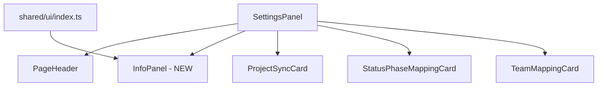

# ADR: Info Panel

**Issue:** [STA-16](linear://issue/STA-16)  
**Date:** 2026-03-30  
**Status:** Draft

---

## Context

The Settings page renders a workflow of three sequential cards (`ProjectSyncCard`, `StatusPhaseMappingCard`, `TeamMappingCard`) but provides no guidance on their purpose or order (see: apps/web/src/widgets/settings-panel/ui/index.tsx:1-39). The only hint is the generic `description="Manage project data synchronization"` in PageHeader (see: apps/web/src/widgets/settings-panel/ui/index.tsx:17-18).

The codebase follows FSD architecture with reusable UI primitives in `shared/ui` (see: apps/web/src/shared/ui/index.ts). Existing patterns include:
- `Card` components with consistent rounded borders, shadow, and spacing (see: apps/web/src/shared/ui/card.tsx:6-8)
- `InfoBadge` for hover tooltips — different use case, not reusable here (see: apps/web/src/shared/ui/info-badge.tsx:10-26)
- `PageHeader` for title/description — too minimal for multi-step instructions (see: apps/web/src/shared/ui/page-header.tsx:1-14)

No existing component matches the "numbered steps with descriptions" pattern required.

## Decision

**Create a new `InfoPanel` component in `shared/ui`** following the existing Card styling conventions (see: apps/web/src/shared/ui/card.tsx:6-8) but with a distinct visual treatment (info/accent background tint) to differentiate instructional content from interactive cards.

The component will:
1. Accept a `steps` prop array with `title` and `description` fields for flexibility
2. Use the existing `cn()` utility and Tailwind classes consistent with Card (see: apps/web/src/shared/ui/card.tsx:3)
3. Be stateless and purely presentational (no collapse/dismiss per Out of Scope)

Integration point: insert between `PageHeader` and `ProjectSyncCard` in SettingsPanel (see: apps/web/src/widgets/settings-panel/ui/index.tsx:16-22), maintaining the existing `space-y-8` layout rhythm.

**Files to change:**
| File | Action |
|------|--------|
| `apps/web/src/shared/ui/info-panel.tsx` | Create — new component |
| `apps/web/src/shared/ui/index.ts` | Modify — add export |
| `apps/web/src/widgets/settings-panel/ui/index.tsx` | Modify — integrate InfoPanel |
| `apps/web/src/shared/ui/__tests__/info-panel.test.tsx` | Create — unit tests |

## Risks

| Severity | Risk | Mitigation |
|----------|------|------------|
| Low | Visual inconsistency with existing cards | Reuse Card border-radius (`rounded-xl`) and shadow from card.tsx:7; only change background to `bg-muted/50` for subtle differentiation |
| Low | Component API too rigid for future use cases | Design with generic `steps` array prop rather than hardcoded content; add optional `title` prop for panel header if needed later |