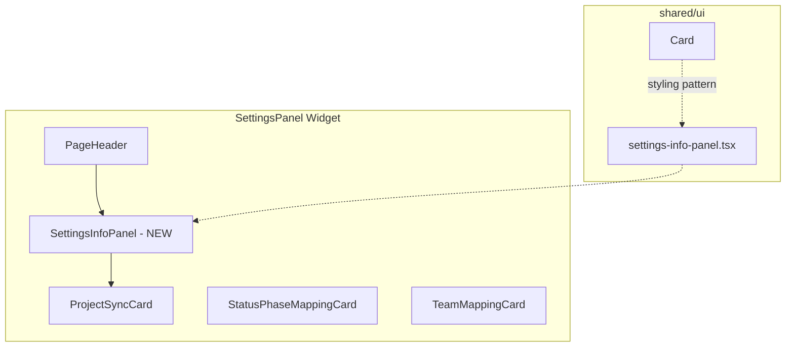

# ADR: Info Panel

**Issue:** [STA-16](linear://issue/STA-16)  
**Date:** 2026-03-30  
**Status:** Draft

---

# Architecture Plan: STA-16 — Info Panel

## Context

The Settings page (`SettingsPanel` widget) displays three configuration cards in a specific workflow order: sync → status mapping → team roles (see: apps/web/src/widgets/settings-panel/ui/index.tsx:22-35). Currently, users receive no guidance about this workflow—only a generic "Manage project data synchronization" description in `PageHeader` (see: apps/web/src/widgets/settings-panel/ui/index.tsx:18-21).

The codebase follows FSD architecture with reusable UI primitives in `shared/ui` (see: apps/web/src/shared/ui/index.ts). Existing components like `Card` provide consistent styling with design tokens (`bg-card`, `border-border`, `text-muted-foreground`) (see: apps/web/src/shared/ui/card.tsx:8-14). The `InfoBadge` component demonstrates the pattern for help/info UI but is tooltip-based, not suitable for prominent onboarding content (see: apps/web/src/shared/ui/info-badge.tsx:14-22).

The `SettingsPanel` widget has medium complexity (39 lines, max indent 6) and uses `space-y-8` for vertical rhythm between sections (see: apps/web/src/widgets/settings-panel/ui/index.tsx:17).

## Decision Drivers

- **Discoverability**: New users must immediately see workflow guidance without interaction
- **FSD compliance**: Component placement must follow Feature-Sliced Design conventions
- **Design consistency**: Must use existing design tokens and Card-like styling patterns
- **Minimal blast radius**: Changes should be localized; `SettingsPanel` has no dependents (see: module dependencies analysis)
- **Static content**: No state, no interactivity (per scope constraints)

## Considered Options

### Option 1: Generic `StepsInfoPanel` in shared/ui

Create a reusable component accepting steps as props:
```tsx
<StepsInfoPanel steps={[{ title: "Sync", description: "..." }, ...]} />
```

- **Pros**: Maximum reusability; clean FSD placement; could be used for other onboarding flows
- **Cons**: Over-engineering for single use case; adds prop complexity; content lives in consumer
- **Effort**: ~5 hours

### Option 2: `SettingsInfoPanel` in shared/ui (static content)

Create a purpose-built component with hardcoded Settings workflow content.

- **Pros**: Simple implementation; content co-located with presentation; matches subtask breakdown
- **Cons**: Settings-specific component in shared layer violates FSD (shared should be business-agnostic); name implies reusability that doesn't exist
- **Effort**: ~4 hours

### Option 3: `WorkflowInfoPanel` in widgets/settings-panel/ui

Create component within the widget that consumes it, export only internally.

- **Pros**: Proper FSD layering (widget-specific UI stays in widget); zero blast radius; content stays with context
- **Cons**: If similar panels needed elsewhere, would require extraction later
- **Effort**: ~3.5 hours

## Decision

**We will use Option 2: `SettingsInfoPanel` in shared/ui** — aligning with the prescribed subtask breakdown while acknowledging the FSD trade-off.

Rationale:
1. The subtasks explicitly specify `shared/ui` placement, and deviating would misalign with decomposition
2. Existing `shared/ui` already contains components with specific naming (`ChartCard`, `MetricCard`, `StatCard`) (see: apps/web/src/shared/ui/index.ts:6,12-13), establishing precedent for semi-specialized components
3. Future extraction to generic `StepsPanel` is straightforward if reuse emerges
4. Component will follow `Card` styling patterns (see: apps/web/src/shared/ui/card.tsx:8-14) for visual consistency

### Component Structure

```
apps/web/src/shared/ui/
├── settings-info-panel.tsx   # New component
└── index.ts                  # Add export
```

Integration point (see: apps/web/src/widgets/settings-panel/ui/index.tsx:17-21):
```tsx
<div className="space-y-8">
  <PageHeader ... />
  <SettingsInfoPanel />        {/* NEW: between header and first card */}
  <div className="max-w-xl">
    <ProjectSyncCard ... />
```

### Visual Design

Component will use:
- `Card`-adjacent styling: `rounded-xl border border-border bg-card` (see: apps/web/src/shared/ui/card.tsx:9-10)
- Muted info aesthetic: `bg-muted/50` background variant to differentiate from action cards
- Numbered step badges with `text-sm font-medium` consistent with existing labels (see: apps/web/src/features/sync-project/ui/index.tsx:43)
- Horizontal 3-column layout on desktop, stack on mobile (`grid grid-cols-1 md:grid-cols-3 gap-4`)



## Consequences

### Positive
- Users gain immediate visibility into the 3-step workflow
- Zero runtime cost (static content, no hooks, no state)
- Single integration point in `SettingsPanel` (see: apps/web/src/widgets/settings-panel/ui/index.tsx)
- Follows existing Card styling patterns for visual consistency

### Negative / Trade-offs
- Settings-specific component in `shared/ui` is a mild FSD violation
- Hardcoded English content (i18n would require refactor)

### Risks

| Severity | Risk | Mitigation |
|----------|------|------------|
| Low | Content becomes stale if workflow changes | Co-locate component near `SettingsPanel` consumer; add code comment linking to STA-16 requirements |
| Low | Visual inconsistency with future design system updates | Use existing design tokens exclusively; no custom colors/spacing |