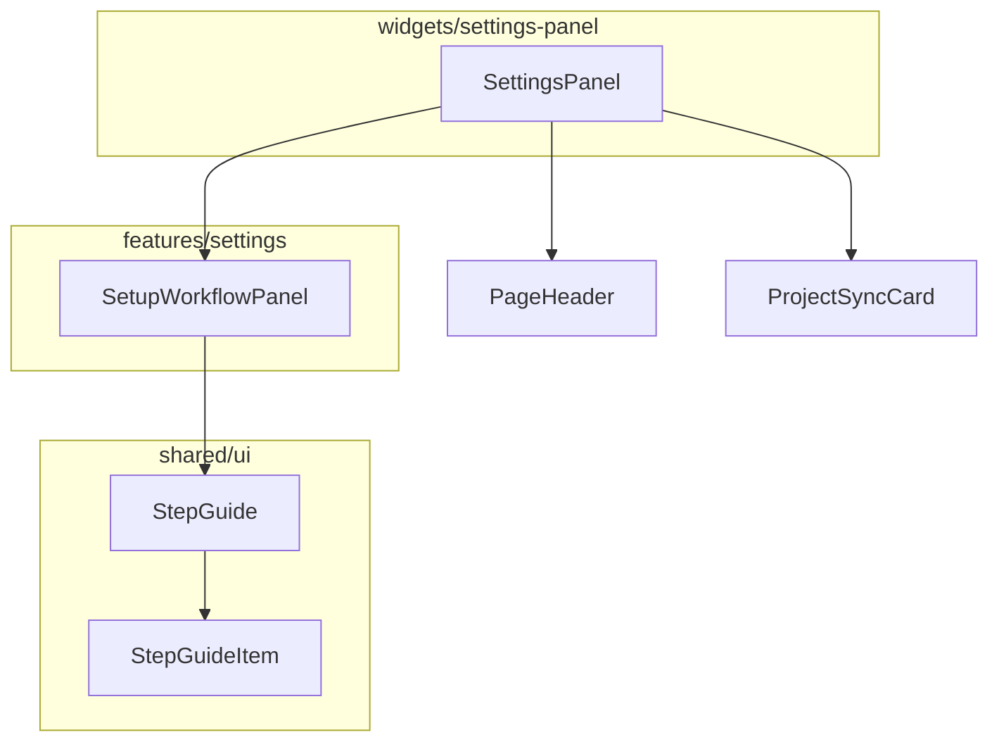

# ADR: Info Panel

**Issue:** [STA-16](linear://issue/STA-16)  
**Date:** 2026-03-30  
**Status:** Draft

---

# Architecture Plan: STA-16 — Info Panel

## Context

The Settings page (`SettingsPanel`) currently provides no guidance on the required workflow for project setup. Users must complete three sequential operations — sync project, map status phases, assign roles — but the only hint is a generic `"Manage project data synchronization"` description in the `PageHeader` (see: apps/web/src/widgets/settings-panel/ui/index.tsx:18-19).

The codebase follows Feature-Sliced Design (FSD): shared UI primitives live in `@/shared/ui` (see: apps/web/src/shared/ui/card.tsx), while domain-specific compositions live in feature modules (see: apps/web/src/features/sync-project/ui/index.tsx:1-20). The existing `Card` component family demonstrates the pattern for reusable containers with consistent styling (see: apps/web/src/shared/ui/card.tsx:5-8 for border/shadow tokens).

Code ownership is concentrated: Konstantin Shchegolev owns 100% of all affected files, simplifying review. The `SettingsPanel` widget has medium complexity (39 lines, max indent 6) and will require minimal modification — only inserting one new component between `PageHeader` and `ProjectSyncCard`.

## Decision Drivers

- **Reusability**: A generic step-list component can be reused for other onboarding flows (e.g., dashboard setup, integration wizards).
- **FSD compliance**: Domain-agnostic UI → `shared/ui`; domain-specific content → `features/`.
- **Minimal blast radius**: `SettingsPanel` has no dependents (see: MODULE DEPENDENCIES), so changes are isolated.
- **Consistency**: Must match existing card styling (border, shadow, spacing) from `@/shared/ui/card.tsx`.

## Considered Options

### Option 1: Single inline component in SettingsPanel

Embed all markup directly in `SettingsPanel`.

- **Pros**: Fastest implementation; no new files.
- **Cons**: Violates FSD (mixes UI + content); not reusable; bloats widget file.
- **Effort**: ~2h

### Option 2: Reusable StepGuide (shared) + SetupWorkflowPanel (feature)

Create a generic `StepGuide` component in `shared/ui` accepting step data, then a `SetupWorkflowPanel` in a new `features/settings` module that composes `StepGuide` with workflow-specific content.

- **Pros**: FSD-compliant; reusable primitive; clear separation of concerns; easy to test each layer independently.
- **Cons**: More files; slightly longer initial implementation.
- **Effort**: ~6h (excluding tests)

### Option 3: Dedicated widget in widgets/settings-info-panel

Create a standalone widget containing both step rendering and content.

- **Pros**: Self-contained; no shared layer change.
- **Cons**: Not reusable; widgets layer is for "assembled features," not primitives.
- **Effort**: ~4h

## Decision

**We will use Option 2: Reusable StepGuide (shared) + SetupWorkflowPanel (feature)**

This aligns with FSD patterns already established: `Card` family in `shared/ui` (see: apps/web/src/shared/ui/card.tsx) demonstrates reusable primitives, while feature-specific compositions exist in `features/*` (see: apps/web/src/features/map-status-phase/ui/index.tsx). The step-guide primitive is likely to be reused in future onboarding surfaces.

## Component Design



### StepGuide API

```tsx
// apps/web/src/shared/ui/step-guide.tsx
interface Step {
  title: string;
  description: string;
}

interface StepGuideProps {
  steps: Step[];
  className?: string;
}
```

Renders a numbered list with step number badges, titles, and descriptions. Styling reuses design tokens from `card.tsx` (border-border, bg-card, text-foreground/muted-foreground).

### SetupWorkflowPanel

```tsx
// apps/web/src/features/settings/ui/setup-workflow-panel.tsx
export function SetupWorkflowPanel() {
  const steps: Step[] = [
    { title: "Sync", description: "Select a Jira project and sync..." },
    { title: "Map Statuses", description: "Drag statuses into..." },
    { title: "Assign Roles", description: "Set each team member's role..." },
  ];
  return <StepGuide steps={steps} />;
}
```

### Integration Point

Modify `SettingsPanel` (see: apps/web/src/widgets/settings-panel/ui/index.tsx:14-15) to insert `SetupWorkflowPanel` between `PageHeader` and the `max-w-xl` container:

```tsx
<PageHeader ... />
<SetupWorkflowPanel />
<div className="max-w-xl">
  <ProjectSyncCard ... />
</div>
```

## Files to Change

| Action | Path | Description |
|--------|------|-------------|
| Create | `apps/web/src/shared/ui/step-guide.tsx` | Generic `StepGuide` + `StepGuideItem` components |
| Modify | `apps/web/src/shared/ui/index.ts` | Export `StepGuide` |
| Create | `apps/web/src/features/settings/ui/setup-workflow-panel.tsx` | Workflow-specific panel with step content |
| Create | `apps/web/src/features/settings/ui/index.ts` | Barrel export |
| Create | `apps/web/src/features/settings/index.ts` | Public API |
| Modify | `apps/web/src/widgets/settings-panel/ui/index.tsx` | Import and render `SetupWorkflowPanel` |

## Consequences

### Positive
- `StepGuide` becomes a reusable primitive for any numbered-step UI.
- Clean FSD layering: shared → feature → widget.
- Low blast radius: only `SettingsPanel` widget changes; no downstream dependents.

### Negative / Trade-offs
- Introduces a new feature module (`features/settings`) with initially only one component.
- Adds 2 new files + 3 barrel exports, increasing surface area.

### Risks

| Severity | Risk | Mitigation |
|----------|------|------------|
| Low | Step text too long on narrow viewports | Use responsive `text-sm`/`text-xs` + truncation; verify in visual regression test |
| Low | Future interactivity (collapse/dismiss) requires refactor | Design `StepGuide` as stateless; state can be lifted to parent later without API change |