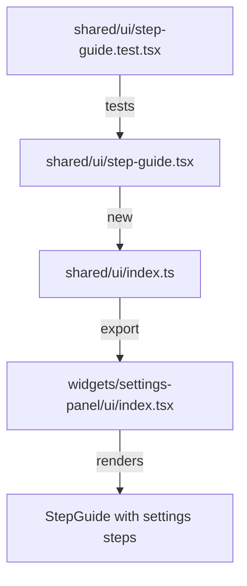

# ADR: Info panel TEST

**Issue:** [STA-18](linear://issue/STA-18)  
**Date:** 2026-03-30  
**Status:** Draft

---

# Architecture Plan — STA-18: Info Panel for Settings Page

## Context

The Settings page at `apps/web/src/widgets/settings-panel/ui/index.tsx` renders three configuration cards (`ProjectSyncCard`, `StatusPhaseMappingCard`, `TeamMappingCard`) that must be completed in sequence, but this workflow is not explained to users (see: apps/web/src/widgets/settings-panel/ui/index.tsx:17-19 — only a generic "Manage project data synchronization" description exists).

The current architecture follows FSD conventions with presentational primitives in `shared/ui` (see: apps/web/src/shared/ui/card.tsx — Card family with 6 composable exports) and page-specific assembly in widgets (see: apps/web/src/widgets/settings-panel/ui/index.tsx:1-6 — imports from entities, features, shared).

Blast radius is minimal: `SettingsPanel` has no dependents (see: MODULE DEPENDENCIES) and the new component will be a leaf node. Single ownership by Konstantin Shchegolev across all affected files simplifies review (see: CODE OWNERSHIP).

## Decision Drivers

- **Consistency**: Must match existing Card visual language (rounded-xl, border-border, shadow-sm) (see: apps/web/src/shared/ui/card.tsx:9-14)
- **Reusability**: Component may be needed on other onboarding-style pages in future
- **Simplicity**: No state, no interactivity — pure presentational component
- **FSD compliance**: Shared UI should be generic; domain-specific content lives in widgets/features

## Considered Options

### Option 1: Generic `StepGuide` in shared/ui + content in widget

Create a reusable `StepGuide` component accepting a `steps` array prop, placed in `shared/ui`. The actual step content (Sync/Map/Assign) is passed from `SettingsPanel`.

```
shared/ui/step-guide.tsx        → generic numbered-step renderer
widgets/settings-panel/ui/      → passes domain-specific steps array
```

- **Pros**: Reusable for future onboarding flows; clean separation of structure vs content
- **Cons**: Over-engineering for a single use case; adds abstraction without immediate reuse evidence
- **Effort**: ~4h

### Option 2: Domain-specific `WorkflowInfoPanel` in shared/ui

Create `WorkflowInfoPanel` with hardcoded step content directly in `shared/ui`. Compose using existing Card primitives.

- **Pros**: Fastest path; matches existing pattern of specialized shared components like `InfoBadge` (see: apps/web/src/shared/ui/info-badge.tsx — also hardcodes domain behavior)
- **Cons**: Content in shared layer violates FSD purity; harder to reuse with different content
- **Effort**: ~2h

### Option 3: Inline composition in SettingsPanel using Card primitives

No new component — compose Card, CardHeader, CardContent directly in `SettingsPanel` with the step content.

- **Pros**: Zero new files; trivial implementation
- **Cons**: Bloats widget; no testability isolation; violates single-responsibility
- **Effort**: ~1h

## Decision

**We will use Option 1: Generic `StepGuide` in shared/ui + content in widget**

Rationale:
1. The existing `Card` family (see: apps/web/src/shared/ui/card.tsx:1-57) demonstrates the project pattern of generic primitives exported from shared/ui — `StepGuide` follows the same philosophy
2. `InfoBadge` precedent shows shared/ui can contain specialized but reusable components (see: apps/web/src/shared/ui/info-badge.tsx:1-26), but that component's hardcoded aria-label suggests we should avoid domain content in shared layer
3. Subtasks already assume a `WorkflowInfoPanel` component — we rename to `StepGuide` for genericity while meeting the same integration point
4. Medium complexity of `SettingsPanel` (see: COMPLEXITY ANALYSIS — 39 lines, max indent 6) means adding inline JSX would push it toward high complexity

### Component API

```typescript
// apps/web/src/shared/ui/step-guide.tsx
interface Step {
  title: string;
  description: string;
}

interface StepGuideProps {
  steps: Step[];
  className?: string;
}

export function StepGuide({ steps, className }: StepGuideProps): JSX.Element
```

### Visual Structure

```
┌─────────────────────────────────────────────────────────────┐
│  ① Step 1: Sync                                             │
│     Select a Jira project and sync its issues...            │
│                                                             │
│  ② Step 2: Map Statuses                                     │
│     Drag statuses into the correct order...                 │
│                                                             │
│  ③ Step 3: Assign Roles                                     │
│     Set each team member's role (Dev, QA)...                │
└─────────────────────────────────────────────────────────────┘
```

Styling reuses Card tokens: `rounded-xl border border-border bg-card` (see: apps/web/src/shared/ui/card.tsx:10-13). Step numbers use `bg-primary text-primary-foreground` circular badges for visual hierarchy.

## File Changes



| File | Action | Description |
|------|--------|-------------|
| `apps/web/src/shared/ui/step-guide.tsx` | Create | Generic StepGuide component with steps prop |
| `apps/web/src/shared/ui/index.ts` | Modify | Add `StepGuide` export |
| `apps/web/src/widgets/settings-panel/ui/index.tsx` | Modify | Import StepGuide, render between PageHeader and ProjectSyncCard with workflow content |
| `apps/web/src/shared/ui/step-guide.test.tsx` | Create | Unit tests for rendering, step count, accessibility |

## Consequences

### Positive
- Workflow is immediately visible to new users without interaction
- `StepGuide` is reusable for any future numbered-step onboarding
- Zero impact on existing components (leaf node addition)
- Single reviewer (Konstantin) simplifies approval

### Negative / Trade-offs
- Adds one new file to shared/ui surface area
- Step content strings live in widget layer — requires update in two places if copy changes

### Risks

| Severity | Risk | Mitigation |
|----------|------|------------|
| Low | Step text may need i18n later | Use plain strings now; extract to constants when i18n is added project-wide |
| Low | Visual clash with existing Card styling | Reuse exact Card tokens from (see: apps/web/src/shared/ui/card.tsx:10-13); verify in subtask 5 |