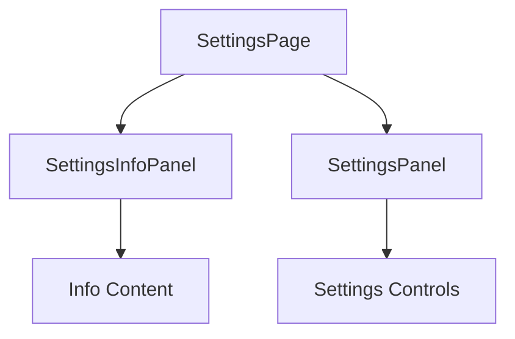

# ADR: Add info panel to Settings page (invalid dor)

**Issue:** [STA-5](linear://issue/STA-5)  
**Date:** 2026-03-29  
**Status:** Draft

---

# ADR: Add Info Panel to Settings Page

## Context

The Settings page currently displays only the main SettingsPanel widget (see: apps/web/src/pages/settings/ui/index.tsx:4). Requirements specify adding an informational panel to guide users through settings configuration, with specific wording requirements and non-dismissible behavior.

Constraints:
- Must integrate with existing SettingsPanel architecture
- Panel must be non-dismissible and always visible
- Responsive design required for mobile/desktop
- Follows Feature-Sliced Design (FSD) structure based on project organization
- Performance impact should be minimal (static content)

## Decision Drivers

- User experience improvement through guided settings configuration
- Consistent widget-based architecture pattern
- Maintainability within existing FSD structure
- Responsive design requirements
- Non-dismissible panel behavior requirement

## Considered Options

### Option 1: Inline Info Component within SettingsPanel
- Modify existing SettingsPanel to include info section directly
- Pros: Simple implementation, single widget boundary
- Cons: Violates single responsibility, harder to test/maintain separately
- Effort: S

### Option 2: Separate SettingsInfoPanel Widget with Page-Level Composition
- Create standalone SettingsInfoPanel widget, compose at page level
- Pros: Follows FSD separation, independent testing, reusable
- Cons: Additional widget structure overhead
- Effort: M

### Option 3: Info Panel as Shared UI Component
- Create as shared/ui component imported by SettingsPanel
- Pros: Lightweight, shared across potential other panels
- Cons: Less discoverable, breaks widget-based pattern
- Effort: XS

## Decision

**We will use Option 2: Separate SettingsInfoPanel Widget with Page-Level Composition**

This aligns with the existing widget-based architecture pattern seen in the SettingsPanel import (see: apps/web/src/pages/settings/ui/index.tsx:1-5). The FSD structure supports independent widgets that can be composed at the page level, allowing better separation of concerns and testability.

## Consequences

### Positive
- Maintains architectural consistency with existing SettingsPanel pattern
- Independent testing and development of info panel functionality
- Clear separation between settings controls and informational content
- Reusable widget for potential future settings-related pages

### Negative / Trade-offs
- Additional widget boilerplate and structure overhead
- Slightly more complex page composition logic
- Two separate widgets to maintain instead of one

### Risks
- **Low**: Integration complexity - standard FSD widget patterns
- **Low**: Performance impact - static informational content
- **Medium**: Responsive layout coordination between two widgets

## Rollout Plan

1. Create `apps/web/src/widgets/settings-info-panel/` directory structure following FSD conventions
2. Implement SettingsInfoPanel component with required UI and styling
3. Update SettingsPage to import and render both SettingsInfoPanel and SettingsPanel
4. Verify responsive behavior across breakpoints
5. Add specific step descriptions as per requirements
6. Test non-dismissible panel behavior and visibility
7. Deploy with feature flag (if applicable) for gradual rollout

