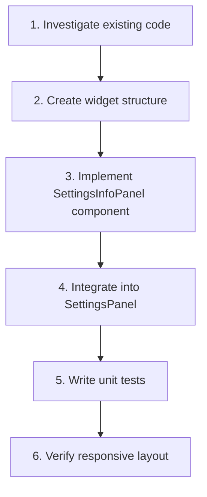

# ADR: Add info panel to Settings page (invalid dor)

**Issue:** [STA-5](linear://issue/STA-5)  
**Date:** 2026-03-29  
**Status:** Draft

---

# ADR: Add Info Panel to Settings Page (STA-5)

## Context

The Settings page contains three configuration cards (`ProjectSyncCard`, `StatusPhaseMappingCard`, `TeamMappingCard`) that must be completed in a specific order. New users lack guidance on:
- The purpose of each configuration step
- The significance of status ordering for cycle time calculation
- The meaning of phases (Backlog/Active/Done) and the IN CYCLE toggle
- Why role assignment matters for dashboard metrics
- When to trigger metric recalculation

The solution is to add a static, always-visible info panel between the `PageHeader` and the first card, explaining the 3-step workflow.

## Code Analysis Summary

**No codebase context was available.** Recommendations are based on the task description only — **[NEEDS INVESTIGATION]** before implementation.

- **Files analyzed**: None. The agent did not read any files from the repository.
- **Patterns discovered**: Task description references FSD widget conventions (`index.ts` + `ui/index.tsx` barrel exports) and mentions existing shared/ui components (`Card`), but these patterns are **unverified**.
- **Reusable components found**: Task claims `Card` exists in `shared/ui` with styling conventions (`bg-muted/50`, `border-border`) — **[NEEDS INVESTIGATION]** to confirm component API and available variants.
- **How analysis influenced the plan**: Without code access, the plan follows the task description's stated conventions. Implementation steps may need adjustment once the actual codebase structure is verified.

### Items Requiring Investigation Before Implementation

| Item | What to verify | Why it matters |
|------|----------------|----------------|
| `shared/ui/Card` component | Actual props API, variant support, default styling | Determines if we can reuse existing Card or need custom wrapper |
| `widgets/settings-panel/ui/index.tsx` | Current structure, how children are composed | Affects integration approach |
| FSD widget conventions in this repo | Actual barrel export pattern used | Ensures consistency with existing widgets |
| Existing spacing/layout tokens | Gap values, container padding used elsewhere | Visual consistency |
| Typography classes in use | Whether `text-sm`, `text-muted-foreground` are standard | Styling consistency |

## Decision Drivers

- **User onboarding**: New users need clear guidance without reading external docs
- **Visual consistency**: Panel must match existing card styling
- **Minimal footprint**: Static content, no state management, no persistence
- **FSD compliance**: Follow existing widget structure patterns
- **Responsive design**: Must work on mobile (stacked) and desktop (3-column grid)

## Considered Options

### Option 1: Dedicated Widget (`widgets/settings-info-panel`)

Create a new FSD-compliant widget with its own barrel export, containing a single presentational component.

**Structure (assumed based on task description):**
```
widgets/
  settings-info-panel/
    index.ts              # re-export
    ui/
      index.tsx           # SettingsInfoPanel component
```

- **Pros**: 
  - Follows FSD conventions (per task requirements)
  - Clear separation, easy to locate
  - Independently testable
- **Cons**: 
  - Adds a new widget for relatively simple static content
- **Effort**: ~7-9h

### Option 2: Inline Component in `settings-panel`

Add the info panel as a local component within `widgets/settings-panel/ui/`.

- **Pros**: 
  - Fewer files, simpler structure
  - Co-located with its only consumer
- **Cons**: 
  - Violates explicit AC #6 requiring dedicated widget
  - Harder to extract if reused elsewhere
- **Effort**: ~5-6h

### Option 3: Shared UI Component (`shared/ui/info-panel`)

Create a generic `InfoPanel` in shared/ui, then use it in settings.

- **Pros**: 
  - Reusable across other pages
  - Clean separation of presentation vs. content
- **Cons**: 
  - Over-engineering for a single use case
  - AC explicitly scopes this to settings
- **Effort**: ~10-12h

## Decision

**We will use Option 1: Dedicated Widget (`widgets/settings-info-panel`)**

Rationale: Acceptance Criterion #6 explicitly requires this structure. While Option 2 would be simpler, we follow the stated requirements. The FSD widget pattern (assumed: `index.ts` barrel + `ui/index.tsx` component) aligns with project conventions **[NEEDS VERIFICATION]**.

## Consequences

### Positive
- Clear, discoverable location for the component
- Matches FSD widget conventions used elsewhere in the project (assumed)
- Easy to test in isolation
- Simple to remove or relocate if requirements change

### Negative / Trade-offs
- Adds 2-3 new files for ~50 lines of JSX
- Slightly deeper import path for a static component

### Risks

| Severity | Risk | Mitigation |
|----------|------|------------|
| **Medium** | Card component API differs from assumption | Investigate `shared/ui/Card` before starting; adjust wrapper if needed |
| **Low** | Spacing/layout doesn't match existing cards | Review adjacent components' spacing; use same gap/padding tokens |
| **Low** | Copy changes requested after implementation | Content is hardcoded strings; easy to update |

## Implementation Steps



### Step 0: Investigation (BLOCKING)
- [ ] **Read `shared/ui/` directory** — confirm Card component exists, document its props API
- [ ] **Read `widgets/settings-panel/ui/index.tsx`** — understand current layout structure
- [ ] **Read any existing widget** — confirm barrel export pattern (`index.ts` re-exporting from `ui/`)
- [ ] **Check Tailwind config / design tokens** — verify `bg-muted/50`, `border-border`, `text-muted-foreground` are available

> ⚠️ Steps 1-5 assume investigation confirms the task description's claims. Adjust if findings differ.

### Step 1: Create widget structure (~0.5h)
- [ ] Create directory `src/widgets/settings-info-panel/`
- [ ] Create `src/widgets/settings-info-panel/ui/index.tsx` — empty component placeholder
- [ ] Create `src/widgets/settings-info-panel/index.ts` — barrel export: `export { SettingsInfoPanel } from './ui'`

### Step 2: Implement SettingsInfoPanel component (~2.5h)
- [ ] Define `STEPS` constant array with step data:
  ```ts
  const STEPS = [
    { number: 1, title: 'Sync', description: 'Select a Jira project and sync its issues, statuses, and team members.' },
    { number: 2, title: 'Map Statuses', description: 'Drag statuses into the correct order and assign each to a phase (Backlog, Active, Done). Mark which statuses count as IN CYCLE for cycle time calculation.' },
    { number: 3, title: 'Assign Roles', description: 'Set each team member\'s role (Dev, QA) to enable per-role metrics on the dashboard. Hit Recalculate Metrics when done.' },
  ]
  ```
- [ ] Implement `SettingsInfoPanel` component using `Card` from `shared/ui` **[verify import path]**
- [ ] Apply container styles: `bg-muted/50 border-border` **[verify tokens exist]**
- [ ] Implement responsive grid: `grid grid-cols-1 lg:grid-cols-3 gap-4` **[verify gap token]**
- [ ] Style step number: `text-foreground font-medium`
- [ ] Style step description: `text-sm text-muted-foreground`
- [ ] Ensure component has no props (static content per AC #4)

### Step 3: Integrate into SettingsPanel (~1h)
- [ ] Open `src/widgets/settings-panel/ui/index.tsx` **[verify path]**
- [ ] Add import: `import { SettingsInfoPanel } from '@/widgets/settings-info-panel'` **[verify alias]**
- [ ] Insert `<SettingsInfoPanel />` between `PageHeader` and `ProjectSyncCard` **[verify component order]**
- [ ] Add appropriate spacing (likely `mb-6` or existing gap class) **[verify spacing convention]**

### Step 4: Write unit tests (~2h)
- [ ] Create `src/widgets/settings-info-panel/__tests__/SettingsInfoPanel.test.tsx`
- [ ] Test: renders all 3 steps with correct titles
- [ ] Test: renders correct descriptions for each step
- [ ] Test: step numbers are visible (1, 2, 3)
- [ ] Test: component renders without props (smoke test)
- [ ] **[NEEDS INVESTIGATION]**: Verify test setup pattern used in this project (Vitest? RTL? existing test examples?)

### Step 5: Verify responsive layout (~2h)
- [ ] Manual test at viewport < `lg` breakpoint: steps stack vertically
- [ ] Manual test at viewport ≥ `lg` breakpoint: 3-column grid
- [ ] Verify spacing matches adjacent cards
- [ ] Verify text is readable on mobile (no overflow/truncation)
- [ ] Screenshot comparison with existing cards for visual consistency

## Questions / Unknowns

### Design/UX
- [ ] **Confirm exact copy**: Are the step descriptions in AC #2 final, or should PM review before merge?
- [ ] **Step titles**: Should titles be bold or just medium weight? ("Sync" vs "**Sync**")
- [ ] **Visual hierarchy**: Should step numbers be larger/circled, or inline with text?

### Business Logic
- [ ] **Future interactivity**: AC #4 says "always visible, no collapse" — confirm this won't change soon (affects component design)
- [ ] **Localization**: Is i18n required for step content, or is English-only acceptable for MVP?

### Technical
- [ ] **Card component API**: Does `shared/ui/Card` accept className for custom bg/border, or does it need a variant prop? **[BLOCKING — verify before Step 2]**
- [ ] **Import alias**: Is `@/widgets/...` the correct path alias, or does project use `~/` or relative imports?
- [ ] **Test framework**: What testing library is used (Vitest + RTL assumed)? Are there existing widget tests to follow as examples?
- [ ] **Storybook**: Does the project use Storybook? If yes, should we add a story for the new component?

## Estimate

| Step | Hours |
|------|-------|
| 0. Investigation (blocking) | 1h |
| 1. Create widget structure | 0.5h |
| 2. Implement component | 2.5h |
| 3. Integrate into SettingsPanel | 1h |
| 4. Write unit tests | 2h |
| 5. Verify responsive layout | 2h |

**Total: ~9 hours**

> ⚠️ Estimate assumes investigation confirms task description's assumptions. Add 1-2h buffer if Card component requires custom wrapper or FSD conventions differ from expected.