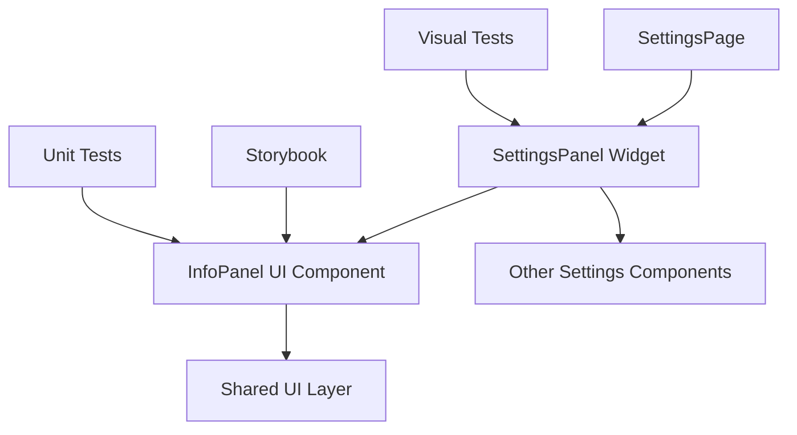

# ADR: Add info panel to Settings page

**Issue:** [STA-5](linear://issue/STA-5)  
**Date:** 2026-03-29  
**Status:** Draft

---

# ADR: Add Info Panel Component to Settings Page

## Context

The Settings page currently displays only the SettingsPanel widget (see: apps/web/src/pages/settings/ui/index.tsx:4). Product requirements specify adding an info panel to provide contextual help and system information to users within the settings interface.

The codebase follows Feature-Sliced Design (FSD) architecture with clear separation between pages, widgets, and shared UI components. The current SettingsPage is minimal, delegating all functionality to the SettingsPanel widget. We need to extend this interface while maintaining architectural consistency and component reusability for potential future use cases.

Constraints:
- Must maintain FSD architectural patterns
- Component should be testable in isolation
- Should support visual regression testing
- Must be documented in Storybook for design system consistency

## Decision Drivers

- Maintain FSD layer separation (pages → widgets → shared)
- Enable component reusability across application
- Support comprehensive testing strategy (unit + visual regression)
- Preserve single responsibility principle for existing components
- Ensure consistent design system documentation

## Considered Options

### Option 1: Extend SettingsPanel Widget Directly
- Add info panel functionality directly within the existing SettingsPanel widget
- Pros: Simple implementation, no additional components
- Cons: Violates single responsibility, reduces reusability, harder to test info panel logic in isolation
- Effort: S

### Option 2: Create InfoPanel as Shared UI Component
- Implement InfoPanel as a reusable UI component in shared layer, compose within SettingsPanel widget
- Pros: Follows FSD patterns, highly reusable, testable in isolation, fits Storybook documentation strategy
- Cons: Slight increase in architectural complexity
- Effort: S

### Option 3: Create InfoPanel as Settings-Specific Widget
- Implement as a widget within settings feature, compose at page level
- Pros: Feature encapsulation, clear separation of concerns
- Cons: Less reusable, adds complexity to page composition, may not align with info panel's generic nature
- Effort: M

## Decision

**We will use Option 2: Create InfoPanel as Shared UI Component**

This aligns with the FSD architecture evidenced by the existing structure (see: apps/web/src/pages/settings/ui/index.tsx), where pages compose widgets and widgets utilize shared components. The subtasks explicitly mention Storybook documentation and unit testing, indicating the component should be reusable and independently testable. This approach maintains the single responsibility of SettingsPanel while enabling InfoPanel reuse across the application.

## Consequences

### Positive
- InfoPanel becomes reusable across different features
- Clean separation enables isolated unit testing
- Supports comprehensive Storybook documentation
- Maintains existing SettingsPanel API stability
- Follows established FSD patterns in codebase

### Negative / Trade-offs
- Additional abstraction layer increases initial complexity
- Requires careful prop interface design for flexibility
- Need to manage InfoPanel state and data dependencies

### Risks
- **Low**: InfoPanel API design may require iteration based on usage patterns
- **Low**: Integration complexity between SettingsPanel and InfoPanel
- **Medium**: Over-engineering if InfoPanel requirements change significantly

## Rollout Plan

1. Create `shared/ui/info-panel` component with basic structure and props interface
2. Add comprehensive unit tests for InfoPanel component behavior
3. Implement InfoPanel integration within SettingsPanel widget (see: @/widgets/settings-panel import pattern)
4. Add visual regression tests covering InfoPanel in settings context
5. Document InfoPanel component in Storybook with usage examples
6. Update settings page documentation to reflect new info panel functionality

