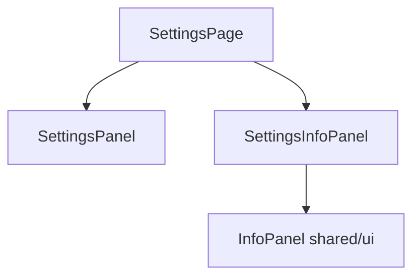

# ADR: Add info panel to Settings page

**Issue:** [STA-5](linear://issue/STA-5)  
**Date:** 2026-03-29  
**Status:** Draft

---

# ADR: Add Info Panel to Settings Page

## Context

The Settings page currently contains only a SettingsPanel widget (see: apps/web/src/pages/settings/ui/index.tsx:5). Product requirements specify adding an informational panel to help users understand settings capabilities and setup procedures.

The codebase follows Feature-Sliced Design architecture patterns, with clear separation between pages, widgets, and shared components. The existing SettingsPage is minimal, acting as a thin wrapper around the SettingsPanel widget.

Constraints:
- Must maintain FSD architecture patterns observed in codebase
- Should be reusable across other pages if needed
- Must not disrupt existing SettingsPanel functionality
- Team prefers component composition over modification of existing widgets

## Decision Drivers

- Need to add informational content without modifying existing SettingsPanel
- InfoPanel component should be reusable beyond settings context
- Must maintain current page simplicity and composition patterns
- Testing strategy should cover both generic InfoPanel and settings-specific usage
- Visual consistency with existing design system

## Considered Options

### Option 1: Extend existing SettingsPanel widget
- Modify SettingsPanel to include info content directly
- Pros: Single component, simpler integration
- Cons: Violates single responsibility, reduces reusability, requires modifying existing widget
- Effort: S

### Option 2: Create InfoPanel in shared/ui + SettingsInfoPanel widget
- Create reusable InfoPanel component in shared layer
- Create SettingsInfoPanel widget containing settings-specific content
- Compose both widgets in SettingsPage
- Pros: Follows FSD patterns, high reusability, separation of concerns, testable in isolation
- Cons: More files to maintain, slightly more complex page composition
- Effort: M

### Option 3: Create settings-specific InfoPanel directly in settings feature
- Create InfoPanel component within settings feature scope
- Integrate directly into SettingsPage
- Pros: Feature-scoped, simpler file structure
- Cons: Not reusable, violates FSD shared layer principles for UI components
- Effort: S

## Decision

**We will use Option 2: Create InfoPanel in shared/ui + SettingsInfoPanel widget**

This approach aligns with the existing FSD architecture pattern observed in the SettingsPage (see: apps/web/src/pages/settings/ui/index.tsx:1-5), where pages compose widgets rather than containing business logic. The InfoPanel component will be reusable across features, while SettingsInfoPanel encapsulates settings-specific content and behavior.

## Consequences

### Positive
- InfoPanel component can be reused in other features requiring informational content
- Clean separation between generic UI component and settings-specific widget
- Maintains existing SettingsPage composition pattern
- Independent testing of component and widget layers

### Negative / Trade-offs
- Additional file structure complexity (2 new components vs 1)
- Page composition becomes slightly more complex with multiple widgets
- Need to coordinate testing across multiple layers

### Risks
- **Low**: Breaking existing SettingsPanel functionality (minimal integration risk)
- **Low**: Design inconsistency (using existing design system patterns)
- **Medium**: Over-engineering for simple info display (mitigated by reusability value)

## Rollout Plan

1. Create `shared/ui/info-panel/` component with generic info display capabilities
2. Create `widgets/settings-info-panel/` widget importing InfoPanel and containing settings-specific content
3. Update `apps/web/src/pages/settings/ui/index.tsx` to compose both SettingsPanel and SettingsInfoPanel widgets
4. Add unit tests for InfoPanel component in shared layer
5. Add unit tests for SettingsInfoPanel widget
6. Conduct visual regression testing against existing Settings page
7. Design review and accessibility audit

