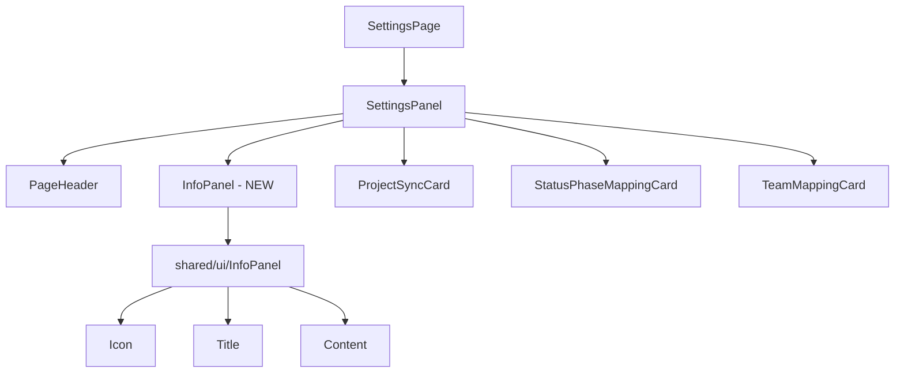

# ADR: Add info panel to Settings page

**Issue:** [STA-5](linear://issue/STA-5)  
**Date:** 2026-03-29  
**Status:** Draft

---

# ADR-001: Add InfoPanel Component to Settings Page

## Context

The current Settings page (see: apps/web/src/widgets/settings-panel/ui/index.tsx:8-35) provides project synchronization functionality but lacks user guidance and contextual information. Users need clear information about what each setting does and how to use the synchronization features effectively.

The existing SettingsPanel structure is minimal with a PageHeader, ProjectSyncCard, and conditionally rendered mapping cards. There's no informational content to help users understand the purpose and workflow of the settings.

**Constraints:**
- Must maintain existing Feature-Sliced Design architecture
- Should not disrupt current project selection workflow
- Must be accessible and responsive
- Should integrate seamlessly with existing Tailwind styling

## Decision Drivers

- **User Experience**: New users need guidance on settings functionality
- **Information Architecture**: Settings page lacks contextual help
- **Consistency**: Other pages may benefit from similar info panels
- **Maintainability**: Component should be reusable across different settings contexts

## Considered Options

### Option 1: Standalone InfoPanel Component
- Create dedicated InfoPanel component in shared/ui
- Place at top of SettingsPanel after PageHeader
- Pros: 
  - Reusable across different pages
  - Clean separation of concerns
  - Easy to maintain and update content
- Cons:
  - Additional component complexity
  - Takes up vertical space
- Effort: S

### Option 2: Integrate Info into PageHeader
- Extend existing PageHeader to include expandable info section
- Pros:
  - Minimal component overhead
  - Compact layout
- Cons:
  - Couples info content to PageHeader
  - Less flexible for different content types
  - Harder to make reusable
- Effort: XS

### Option 3: Floating Info Sidebar
- Create floating/collapsible info panel
- Pros:
  - Doesn't take up main content space
  - Always accessible
- Cons:
  - Complex implementation
  - Potential mobile UX issues
  - May feel disconnected from content
- Effort: L

## Decision

**We will use Option 1: Standalone InfoPanel Component**

This approach aligns with the Feature-Sliced Design architecture already used in the codebase (see: apps/web/src/widgets/settings-panel/ui/index.tsx:3-6) where components are imported from shared/ui. It provides the best balance of reusability, maintainability, and user experience.

## Consequences

### Positive
- Reusable component for other pages requiring contextual information
- Clear separation between informational and functional content
- Easy to update content without affecting other components
- Consistent with existing component architecture patterns

### Negative / Trade-offs
- Additional component to maintain
- Increases bundle size slightly
- Takes up vertical space on the page
- Need to design content structure and styling

### Risks
- **Low**: InfoPanel content becomes outdated if not maintained
- **Low**: May create visual clutter if overused
- **Medium**: Content structure needs to be flexible enough for different contexts

## Rollout Plan

1. **Create InfoPanel component in shared/ui**
   - Define props interface for title, content, icon
   - Implement responsive design with Tailwind
   - Add accessibility attributes (ARIA labels, keyboard navigation)

2. **Design content structure for Settings info**
   - Define informational content about project sync workflow
   - Add helpful tips and links to documentation
   - Include visual hierarchy with icons and styling

3. **Integrate InfoPanel into SettingsPanel**
   - Import InfoPanel in settings-panel widget (see: apps/web/src/widgets/settings-panel/ui/index.tsx:7)
   - Add after PageHeader but before ProjectSyncCard
   - Maintain existing spacing and layout patterns

4. **Add visual prominence and styling**
   - Use consistent icon system
   - Apply appropriate color scheme and spacing
   - Ensure mobile responsiveness

5. **Testing and accessibility validation**
   - Test screen reader compatibility
   - Verify keyboard navigation
   - Test on mobile devices
   - Validate against WCAG guidelines

**Feature flags**: None required - component will be immediately visible
**Backwards compatibility**: Full - no breaking changes to existing functionality
**Migration**: None required - purely additive change