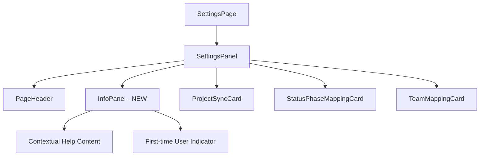

# ADR: Add info panel to Settings page

**Issue:** [STA-5](linear://issue/STA-5)  
**Date:** 2026-03-29  
**Status:** Draft

---

# ADR: Add Info Panel to Settings Page

## Context

The Settings page currently provides project synchronization and mapping functionality without sufficient guidance for users (see: apps/web/src/widgets/settings-panel/ui/index.tsx:8-35). User feedback indicates confusion about the proper sequence of operations and the purpose of each settings section. The current implementation shows a `PageHeader` with minimal description and conditional mapping cards that appear only after project sync, creating a discovery problem for new users.

Constraints:
- Must maintain existing layout and responsive grid system (see: apps/web/src/widgets/settings-panel/ui/index.tsx:28-31)
- Should leverage existing shared UI components (see: apps/web/src/shared/ui/index.ts:14-15)
- Performance impact must be minimal as this is a configuration page
- Team prefers Feature-Sliced Design architecture patterns

## Decision Drivers

- Users need contextual guidance for multi-step settings workflow
- Existing `InfoBadge` and `InfoRow` components suggest established info display patterns
- Settings flow has conditional visibility that requires explanation
- First-time user experience needs improvement
- Maintainability requires reusable component architecture

## Considered Options

### Option 1: Dedicated InfoPanel Component
- Create standalone `InfoPanel` component in shared UI
- Display contextual help content based on current settings state
- Integrate directly into SettingsPanel layout
- Pros: Reusable across app, clear separation of concerns, aligns with FSD
- Cons: Additional component to maintain, potential layout complexity
- Effort: M

### Option 2: Extend Existing InfoBadge/InfoRow Pattern
- Enhance existing info components with expandable help content
- Embed info elements inline with each settings section
- Leverage current `InfoBadge` and `InfoRow` components (see: apps/web/src/shared/ui/index.ts:14-15)
- Pros: Minimal new code, consistent with existing patterns
- Cons: Scattered information, harder to provide comprehensive guidance
- Effort: S

### Option 3: Modal-Based Help System
- Create help modal triggered by info icon in PageHeader
- Centralize all settings documentation in modal overlay
- Pros: Doesn't affect main layout, comprehensive help possible
- Cons: Hidden by default, breaks contextual help principle, additional modal management
- Effort: L

## Decision

**We will use Option 1: Dedicated InfoPanel Component**

This aligns with the existing shared UI component pattern (see: apps/web/src/shared/ui/index.ts) and provides the flexibility needed for contextual, state-aware guidance. The current `SettingsPanel` layout with `space-y-8` styling can accommodate an additional panel section without disrupting the responsive grid for mapping cards (see: apps/web/src/widgets/settings-panel/ui/index.tsx:28).

## Consequences

### Positive
- Provides contextual guidance for multi-step settings workflow
- Reusable component follows established FSD architecture patterns
- Can display state-aware content (show/hide based on selectedKey and lastSync)
- Improves first-time user experience with clear instructions

### Negative / Trade-offs
- Additional component increases bundle size (estimated ~2KB)
- Requires content management for help text maintenance
- May increase visual complexity of settings page

### Risks
- **Low**: Component complexity - straightforward display logic
- **Medium**: Content maintenance - help text may become outdated
- **Low**: Layout disruption - existing grid system is flexible

## Rollout Plan

1. Create `InfoPanel` component in `apps/web/src/shared/ui/info-panel/`
2. Add component export to `apps/web/src/shared/ui/index.ts`
3. Create settings instruction content with step-by-step guidance
4. Integrate `InfoPanel` into `SettingsPanel` before ProjectSyncCard section
5. Add conditional display logic based on `selectedKey` state
6. Implement visual indicator (info icon) for first-time users using localStorage
7. Add unit tests for InfoPanel component and integration
8. Deploy behind feature flag `SETTINGS_INFO_PANEL` for gradual rollout

