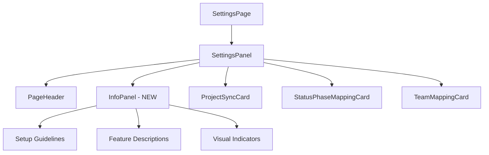

# ADR: Add info panel to Settings page

**Issue:** [STA-5](linear://issue/STA-5)  
**Date:** 2026-03-29  
**Status:** Draft

---

# ADR: Add Info Panel to Settings Page

## Status
Proposed

## Context

The Settings page currently provides project synchronization and configuration capabilities without contextual help or feature explanations (see: apps/web/src/widgets/settings-panel/ui/index.tsx:12-36). Users need guidance on:
- What each configuration section does
- Setup prerequisites and best practices
- Visual connections between info and actionable components

Current layout uses vertical stacking with conditional rendering based on project selection (see: apps/web/src/widgets/settings-panel/ui/index.tsx:25-33). The page follows Feature-Sliced Design architecture with widgets, features, and entities separation.

**Constraints:**
- Must not disrupt existing workflow for experienced users
- Should integrate with current responsive grid layout (lg:grid-cols-2)
- Must maintain accessibility standards
- Team preference for collapsible UI elements to reduce visual clutter

## Decision Drivers

- Users report confusion about configuration order and purpose
- Settings page lacks onboarding guidance for new users
- Need to explain complex features like status-phase mapping without cluttering interface
- Must preserve current responsive layout behavior
- Support progressive disclosure UI pattern used elsewhere in codebase

## Considered Options

### Option 1: Sidebar InfoPanel
- Persistent or collapsible panel on the right side
- Pros: Doesn't affect main content flow, contextual help always available
- Cons: Reduces horizontal space for main content, complex responsive behavior
- Effort: L

### Option 2: Top Banner InfoPanel  
- Expandable section above existing content
- Pros: Clear hierarchy, doesn't interfere with grid layout, simple responsive
- Cons: Pushes content down when expanded, less contextual
- Effort: M

### Option 3: Integrated Card InfoPanels
- Info sections within or adjacent to each configuration card
- Pros: Highly contextual, maintains current layout patterns
- Cons: Clutters individual cards, harder to provide overview guidance
- Effort: XL

## Decision

**We will use Option 2: Top Banner InfoPanel**

The current vertical layout with `space-y-8` (see: apps/web/src/widgets/settings-panel/ui/index.tsx:12) naturally accommodates an additional top section. This approach aligns with the existing `PageHeader` pattern and won't interfere with the conditional grid layout for mapping cards (see: apps/web/src/widgets/settings-panel/ui/index.tsx:25-33).

## Consequences

### Positive
- Maintains existing responsive grid layout for configuration cards
- Follows established vertical stacking pattern in SettingsPanel
- Provides overview guidance before users interact with specific features
- Easy to implement progressive disclosure with collapse/expand

### Negative / Trade-offs
- Adds vertical height that pushes configuration content down when expanded
- Info content is less contextual than sidebar approach
- Requires users to scroll back up if they need info while configuring

### Risks
- **Low**: Layout integration conflicts with existing spacing
- **Low**: Performance impact from additional component rendering  
- **Medium**: User confusion if info content becomes stale or inaccurate

## Rollout Plan

1. Create `InfoPanel` component in `shared/ui` following existing card patterns
   - Implement collapsible sections using current UI library components
   - Add accessibility attributes (ARIA labels, focus management)

2. Update `SettingsPanel` to include `InfoPanel` after `PageHeader`
   ```tsx
   <PageHeader title="Settings" description="..." />
   <InfoPanel />
   <div className="max-w-xl">...</div>
   ```

3. Populate InfoPanel with feature descriptions and setup guidelines
   - Add visual indicators (icons, colors) linking to corresponding cards
   - Include progressive disclosure sections for advanced topics

4. Add feature flag `SETTINGS_INFO_PANEL` for gradual rollout
   - Default collapsed state for existing users
   - Default expanded for new user onboarding flow

5. Test responsive behavior and accessibility compliance
   - Verify screen reader compatibility
   - Test keyboard navigation flow
   - Validate mobile layout behavior

