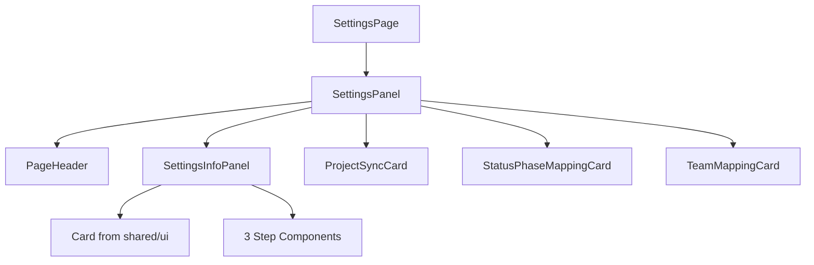

# ADR: Add info panel to Settings page

**Issue:** [STA-6](linear://issue/STA-6)  
**Date:** 2026-03-29  
**Status:** Draft

---

# ADR: Add Settings Info Panel Widget

## Context

Страница Settings содержит три карточки настроек без объяснения порядка их выполнения (see: apps/web/src/widgets/settings-panel/ui/index.tsx:22-34). Новые пользователи не понимают workflow настройки проекта: зачем нужна синхронизация, что означают фазы статусов, зачем назначать роли командам. Единственная подсказка — строка "Manage project data synchronization" в PageHeader (see: apps/web/src/widgets/settings-panel/ui/index.tsx:17-20).

Требуется добавить информационную панель, описывающую воркфлоу по шагам между PageHeader и ProjectSyncCard.

## Code Analysis Summary

Files analyzed and key findings:

- **apps/web/src/widgets/settings-panel/ui/index.tsx**: Основной виджет страницы Settings. Использует вертикальную компоновку с `space-y-8`, рендерит PageHeader, затем ProjectSyncCard в контейнере `max-w-xl`, затем условно StatusPhaseMappingCard и TeamMappingCard в responsive grid `grid-cols-1 lg:grid-cols-2`.

- **apps/web/src/shared/ui/card.tsx**: Полная система Card компонентов с композицией Header/Title/Description/Content/Footer. Использует стили `rounded-xl border border-border bg-card text-card-foreground shadow-sm`.

- **apps/web/src/pages/settings/ui/index.tsx**: Тонкая обёртка вокруг SettingsPanel виджета, следует FSD паттерну.

Patterns discovered:
- Все страницы — тонкие обёртки вокруг feature-виджетов
- Виджеты располагаются в `widgets/{name}/ui/index.tsx` с barrel export в `widgets/{name}/index.ts`
- Используется композиция Card компонентов для UI карточек
- Responsive grid layouts с breakpoint `lg:`

Existing components found:
- Card system в `shared/ui` для стилизации
- PageHeader в `shared/ui` для заголовков
- cn utility для классов tailwind

## Decision Drivers

- Необходимо объяснить 3-шаговый workflow настройки проекта
- Панель должна быть статичной (всегда видимой)
- Responsive дизайн (вертикальный на мобильных, 3 колонки на десктопе)  
- Следовать FSD архитектуре (новый виджет в widgets/)
- Переиспользовать существующие UI компоненты (Card)
- Интегрироваться в текущую компоновку SettingsPanel

## Considered Options

### Option 1: Компонент внутри SettingsPanel
- Что это: Добавить JSX прямо в SettingsPanel без создания отдельного виджета
- Pros: Быстрая реализация, нет новых файлов
- Cons: Нарушает FSD принципы, усложняет SettingsPanel, плохо для переиспользования
- Effort: 2 часа

### Option 2: Feature компонент в features/
- Что это: Создать в `features/settings-info/` как feature-компонент
- Pros: Соответствует domain-логике настроек
- Cons: Info panel — не интерактивная feature, а статичный UI widget
- Effort: 4 часа

### Option 3: Widget компонент в widgets/settings-info-panel/
- Что это: Создать новый виджет следуя FSD паттерну (see: существующий паттерн в widgets/settings-panel/)
- Pros: Соответствует FSD (widgets = композитный UI), переиспользуемый, тестируемый
- Cons: Больше файловой структуры
- Effort: 6 часов

## Decision

**We will use Option 3: Widget компонент в widgets/settings-info-panel/**

Rationale: Следует установленным FSD паттернам в кодебазе (see: widgets/settings-panel/). Info panel — это композитный UI элемент без бизнес-логики, что идеально подходит для widgets слоя. Обеспечивает переиспользование, тестируемость и соответствует архитектуре проекта.

## Consequences

### Positive
- Соответствует FSD архитектуре проекта
- Переиспользуемый и тестируемый компонент  
- Чистое разделение ответственности
- Легко модифицировать независимо от SettingsPanel

### Negative / Trade-offs
- Дополнительная файловая структура (3 новых файла)
- Немного больше времени на реализацию

### Risks
- **Low**: Может потребоваться обновление родительских exports если добавятся внешние импорты виджета
- **Low**: Responsive breakpoints могут не совпадать с дизайном (mitigation: использовать те же lg: что в существующем коде)

## Implementation Steps

1. Create `apps/web/src/widgets/settings-info-panel/ui/index.tsx` — компонент SettingsInfoPanel с 3 шагами в Card layout
2. Create `apps/web/src/widgets/settings-info-panel/index.ts` — barrel export для виджета  
3. Modify `apps/web/src/widgets/settings-panel/ui/index.tsx:16` — add import SettingsInfoPanel
4. Modify `apps/web/src/widgets/settings-panel/ui/index.tsx:21` — insert SettingsInfoPanel между PageHeader и ProjectSyncCard
5. Create `apps/web/src/widgets/settings-info-panel/__tests__/index.test.tsx` — unit tests для компонента
6. Test responsive layout на мобильном (<lg) и десктопе (lg+)

## Questions / Unknowns

**Design/UX unknowns:**
- Точный wording для шагов — использовать предложенный в AC или нужна ли корректировка?
- Spacing между панелью и ProjectSyncCard — использовать тот же space-y-8?

**Technical unknowns:**
- Нужно ли добавлять data-testid атрибуты для E2E тестов?
- Требуется ли accessibility (ARIA) разметка для информационной панели?

## Estimate

**Total: 8 hours**

- Step 1 (Create SettingsInfoPanel component): 3h
- Step 2 (Create barrel export): 0.5h  
- Step 3-4 (Integration into SettingsPanel): 1h
- Step 5 (Unit tests): 2.5h
- Step 6 (Responsive testing): 1h