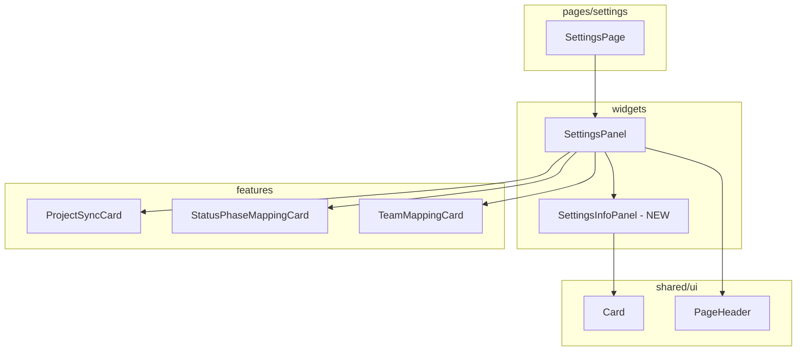

# ADR: Add info panel to Settings page

**Issue:** [STA-6](linear://issue/STA-6)  
**Date:** 2026-03-29  
**Status:** Draft

---

# Architecture Plan: STA-6 — Add info panel to Settings page

## Context

The Settings page currently renders three configuration cards (`ProjectSyncCard`, `StatusPhaseMappingCard`, `TeamMappingCard`) without explaining the required workflow sequence (see: apps/web/src/widgets/settings-panel/ui/index.tsx:17-35). The only guidance is a generic "Manage project data synchronization" description in `PageHeader` (see: apps/web/src/widgets/settings-panel/ui/index.tsx:18-19).

The codebase follows Feature-Sliced Design (FSD) with widgets located in `widgets/` layer, each with a standard structure: `ui/index.tsx` for the component and `index.ts` for barrel export (see: apps/web/src/widgets/settings-panel/index.ts). Shared UI primitives including `Card`, `CardContent` are available in `shared/ui` (see: apps/web/src/shared/ui/card.tsx:1-57) and exported via barrel (see: apps/web/src/shared/ui/index.ts:2).

The existing `Card` component uses composable sub-components (`CardHeader`, `CardContent`, etc.) with Tailwind classes and supports className override via `cn()` utility (see: apps/web/src/shared/ui/card.tsx:6-16). Current cards use `bg-card` background; the requirement specifies `bg-muted/50` for visual differentiation.

## Decision Drivers

- **FSD compliance**: New UI blocks at page-composition level belong in `widgets/` layer
- **Consistency**: Must reuse existing `Card` primitives rather than creating new styled containers
- **Simplicity**: Static content with no state, API calls, or interactivity — pure presentational component
- **Minimal blast radius**: `SettingsPanel` is the only integration point (see: apps/web/src/widgets/settings-panel/ui/index.tsx); no changes to `shared/ui` or features required

## Considered Options

### Option 1: Inline JSX in SettingsPanel

Add the info panel markup directly inside `SettingsPanel` component.

- **Pros**: Zero new files, fastest implementation
- **Cons**: Violates FSD (widgets should be composable units), bloats SettingsPanel, harder to test in isolation
- **Effort**: ~1 hour

### Option 2: New widget `settings-info-panel`

Create dedicated widget at `widgets/settings-info-panel/` following existing FSD pattern.

- **Pros**: FSD-compliant, testable in isolation, reusable if needed elsewhere, matches existing widget structure (see: apps/web/src/widgets/settings-panel/index.ts)
- **Cons**: More files for simple content
- **Effort**: ~2 hours

### Option 3: Shared UI component in `shared/ui`

Create `StepsPanel` or similar in shared layer.

- **Pros**: Maximum reusability
- **Cons**: This is page-specific content, not a generic primitive; pollutes shared layer with domain-specific text; violates FSD principles for shared layer
- **Effort**: ~2 hours

## Decision

**We will use Option 2: New widget `settings-info-panel`**

This approach aligns with the established FSD widget pattern visible in the codebase (see: apps/web/src/widgets/settings-panel/index.ts). The widget encapsulates domain-specific onboarding content while reusing shared primitives. The `Card` component's className override capability (see: apps/web/src/shared/ui/card.tsx:9) allows applying `bg-muted/50` without modifying shared code.



### Files to Change

| Action | Path | Description |
|--------|------|-------------|
| CREATE | `apps/web/src/widgets/settings-info-panel/ui/index.tsx` | `SettingsInfoPanel` component with 3-step grid layout |
| CREATE | `apps/web/src/widgets/settings-info-panel/index.ts` | Barrel export |
| MODIFY | `apps/web/src/widgets/settings-panel/ui/index.tsx` | Import and render `SettingsInfoPanel` between `PageHeader` and content |

### Component Structure

```tsx
// widgets/settings-info-panel/ui/index.tsx
export function SettingsInfoPanel() {
  return (
    <Card className="bg-muted/50">
      <CardContent className="p-6">
        <div className="grid grid-cols-1 lg:grid-cols-3 gap-6">
          {/* Step items */}
        </div>
      </CardContent>
    </Card>
  );
}
```

### Integration Point

In `SettingsPanel` (see: apps/web/src/widgets/settings-panel/ui/index.tsx:17-22), the new widget slots between `PageHeader` and the first card:

```tsx
<PageHeader ... />
<SettingsInfoPanel />  {/* NEW */}
<div className="max-w-xl">
  <ProjectSyncCard ... />
</div>
```

## Consequences

### Positive

- Follows established FSD widget pattern — consistent with codebase conventions
- Zero changes to shared layer — `Card` className override handles styling (see: apps/web/src/shared/ui/card.tsx:9)
- Testable in isolation — can unit test step content and responsive breakpoints independently
- Single integration point — only `SettingsPanel` changes, minimal blast radius

### Negative / Trade-offs

- Additional widget directory for static content (3 files including test)
- Step text is hardcoded in component rather than i18n — acceptable per AC (English only, no i18n requirement)

### Risks

| Severity | Risk | Mitigation |
|----------|------|------------|
| Low | Step text becomes stale if workflow changes | Co-locate with SettingsPanel so changes are visible; add code comment linking to STA-6 |
| Low | `bg-muted/50` may not contrast well in all themes | Verify against both light/dark themes in visual regression test |