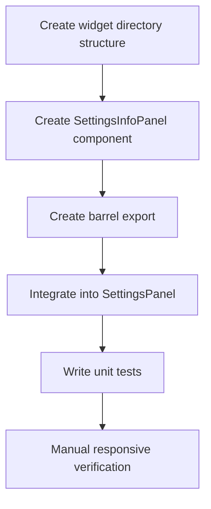

# ADR: Add info panel to Settings page

**Issue:** [STA-6](linear://issue/STA-6)  
**Date:** 2026-03-29  
**Status:** Draft

---

# ADR: STA-6 — Add info panel to Settings page

## Context

The Settings page (`apps/web/src/pages/settings/ui/index.tsx`) renders three configuration cards via `SettingsPanel` widget: `ProjectSyncCard`, `StatusPhaseMappingCard`, and `TeamMappingCard`. These must be completed in a specific order, but this workflow is not documented in the UI.

New users lack understanding of:
- Why sync is needed and what data it pulls from Jira
- How status ordering affects cycle time calculation
- What phases (Backlog/Active/Done) and IN CYCLE toggle mean
- Why role assignment matters for the dashboard
- That "Recalculate Metrics" must be triggered after mapping changes

The requirement is to add a static, non-dismissible info panel between `PageHeader` and `ProjectSyncCard` explaining the 3-step setup workflow.

(see: `apps/web/src/widgets/settings-panel/ui/index.tsx:17-21` — current layout order)

---

## Code Analysis Summary

### Files analyzed
| File | Key Finding |
|------|-------------|
| `apps/web/src/pages/settings/ui/index.tsx` | Thin FSD page wrapper, renders only `<SettingsPanel />` |
| `apps/web/src/widgets/settings-panel/ui/index.tsx` | 39 lines, medium complexity; uses `space-y-8` vertical rhythm, composes `PageHeader` + 3 feature cards |
| `apps/web/src/widgets/settings-panel/index.ts` | Barrel export pattern: `export { SettingsPanel } from "./ui"` |
| `apps/web/src/shared/ui/card.tsx` | 57 lines, 6 exports (`Card`, `CardHeader`, `CardTitle`, `CardDescription`, `CardContent`, `CardFooter`); base styles: `rounded-xl border border-border bg-card` |
| `apps/web/src/shared/ui/page-header.tsx` | Simple component with `title` + optional `description`; uses `text-sm text-muted-foreground` for description |
| `apps/web/src/features/sync-project/ui/index.tsx` | 127 lines, uses `Card`/`CardHeader`/`CardContent` from shared/ui |
| `apps/web/src/features/map-status-phase/ui/index.tsx` | Uses same Card pattern; includes recalculate mutation |
| `apps/web/src/features/map-member-role/ui/index.tsx` | Uses same Card pattern; role assignment UI |

### Patterns discovered
- **FSD widget convention**: widgets follow `widgets/<name>/index.ts` + `widgets/<name>/ui/index.tsx` barrel export structure (see: `widgets/settings-panel/index.ts`)
- **Card usage**: all settings cards import `Card`, `CardHeader`, `CardTitle`, `CardContent` from `@/shared/ui` (see: `features/sync-project/ui/index.tsx:4`)
- **Spacing system**: `SettingsPanel` uses `space-y-8` for vertical gaps between sections (see: `widgets/settings-panel/ui/index.tsx:17`)
- **Responsive grid**: existing cards use `grid grid-cols-1 lg:grid-cols-2` pattern (see: `widgets/settings-panel/ui/index.tsx:27`)
- **Text styles**: muted descriptions use `text-sm text-muted-foreground` consistently (see: `shared/ui/page-header.tsx:12`)

### Reusable components found
- `Card`, `CardContent` from `@/shared/ui/card.tsx` — will use for panel container
- `cn()` utility from `@/shared/lib/cn` — for conditional class merging (referenced in card.tsx:2)

### How analysis influenced the plan
The existing widget structure and Card component patterns provide a clear template. The new `settings-info-panel` widget will mirror the `settings-panel` barrel export structure and reuse `Card` + `CardContent` to maintain visual consistency with existing cards. The `space-y-8` gap in `SettingsPanel` means the new panel will automatically receive proper spacing when inserted.

---

## Decision Drivers

- **Consistency**: Must follow existing FSD widget conventions to avoid architectural drift
- **Reusability**: Requirement explicitly mandates `widgets/settings-info-panel/` structure
- **Visual coherence**: Must match existing card styling (`bg-muted/50` variant specified in AC)
- **Responsiveness**: AC specifies `grid-cols-1 lg:grid-cols-3` breakpoint behavior
- **Minimal blast radius**: Single integration point in `SettingsPanel`

---

## Considered Options

### Option 1: New FSD widget (`widgets/settings-info-panel/`)

Create a dedicated widget following established conventions.

**Structure:**
```
widgets/settings-info-panel/
├── index.ts          # barrel export
└── ui/
    └── index.tsx     # SettingsInfoPanel component
```

**Pros:**
- Follows FSD conventions (see: `widgets/settings-panel/index.ts`)
- Matches AC requirement explicitly
- Single responsibility; easy to test in isolation
- Can be reused if similar onboarding panels needed elsewhere

**Cons:**
- Slightly more files than inline approach

**Effort:** ~4 hours

---

### Option 2: Inline component in `SettingsPanel`

Define the info panel directly inside `widgets/settings-panel/ui/index.tsx`.

**Pros:**
- Fewer files
- Faster initial implementation

**Cons:**
- Violates FSD conventions — widgets should not define other UI components inline
- Harder to test in isolation
- Increases complexity of already medium-complexity file (39 lines → ~80 lines)
- Does not match AC requirement

**Effort:** ~2 hours

---

### Option 3: Extend `PageHeader` with optional children/info slot

Add a `children` or `info` prop to `PageHeader` for inline content.

**Pros:**
- No new files
- Reusable pattern for other pages

**Cons:**
- Violates single responsibility — `PageHeader` is a presentational atom
- Info panel has different styling (Card-based) than PageHeader
- Does not match AC requirement for widget structure

**Effort:** ~3 hours

---

## Decision

**We will use Option 1: New FSD widget (`widgets/settings-info-panel/`)**

**Rationale:** The AC explicitly requires FSD widget structure. Existing widgets follow the `index.ts` + `ui/index.tsx` barrel export pattern (see: `widgets/settings-panel/index.ts:1`). This approach maintains architectural consistency and keeps the component testable in isolation. The slight overhead of additional files is justified by adherence to established conventions.

---

## Consequences

### Positive
- Consistent FSD architecture across all widgets
- Info panel is testable in isolation
- Clear separation of concerns — `SettingsPanel` remains a composition layer
- Easy to locate and modify in future (dedicated directory)

### Negative / Trade-offs
- Two new files instead of one (minimal overhead)
- Requires import addition in `SettingsPanel`

### Risks

| Risk | Severity | Mitigation |
|------|----------|------------|
| Styling mismatch with existing cards | Low | Use same `Card` component with `bg-muted/50` override as specified in AC |
| Responsive grid breaks on edge breakpoints | Low | Test at 1023px and 1024px boundaries; use Tailwind's `lg:` prefix consistently |
| Copy changes requested post-implementation | Low | Keep step content as inline strings; easy to update |

---

## Implementation Steps



### Step 1: Create widget directory structure
- Create directory `apps/web/src/widgets/settings-info-panel/`
- Create subdirectory `apps/web/src/widgets/settings-info-panel/ui/`

### Step 2: Create `SettingsInfoPanel` component
- Create `apps/web/src/widgets/settings-info-panel/ui/index.tsx`
- Import `Card`, `CardContent` from `@/shared/ui`
- Define `SettingsInfoPanel` functional component (no props needed — static content)
- Implement 3-step grid layout:
  ```tsx
  <Card className="bg-muted/50 border-border">
    <CardContent className="pt-6">
      <div className="grid grid-cols-1 lg:grid-cols-3 gap-6">
        {/* Step items */}
      </div>
    </CardContent>
  </Card>
  ```
- Each step: `<div>` with step number (`text-foreground font-medium`) + description (`text-sm text-muted-foreground`)
- Export component as named export

### Step 3: Create barrel export
- Create `apps/web/src/widgets/settings-info-panel/index.ts`
- Add: `export { SettingsInfoPanel } from "./ui";`

### Step 4: Modify `SettingsPanel` to render info panel
- Modify `apps/web/src/widgets/settings-panel/ui/index.tsx:1` — add import: `import { SettingsInfoPanel } from "@/widgets/settings-info-panel";`
- Modify `apps/web/src/widgets/settings-panel/ui/index.tsx:20` — insert `<SettingsInfoPanel />` between `<PageHeader />` and `<div className="max-w-xl">`

### Step 5: Write unit tests
- Create `apps/web/src/widgets/settings-info-panel/ui/__tests__/index.test.tsx`
- Test: component renders without crashing
- Test: all 3 step headings are present ("Step 1", "Step 2", "Step 3")
- Test: step descriptions contain key terms ("Sync", "Map Statuses", "Assign Roles")
- Test: grid container has correct responsive classes

### Step 6: Manual responsive verification
- Verify at `< lg` (1023px): steps stack vertically (single column)
- Verify at `>= lg` (1024px): steps display in 3 columns
- Verify spacing between PageHeader, InfoPanel, and ProjectSyncCard is consistent (`space-y-8` gap)

---

## Questions / Unknowns

### Design/UX
- **Confirm exact copy**: The step descriptions in AC are provided, but should they include any emphasis (bold keywords)? [Assuming plain text per AC]
- **Step numbering format**: Should it be "Step 1:" or "1." or a circled number badge? [Assuming "Step 1:" per AC wording]

### Business Logic
- **Future interactivity**: AC explicitly excludes collapse/dismiss. Confirm this panel should NEVER be dismissible even in future iterations? (Affects whether we need to plan for state persistence)

### Technical
- **Shared/ui barrel export**: Should `Card` already be exported from `@/shared/ui/index.ts` barrel? Need to verify import path works. [NEEDS INVESTIGATION — if not, may need `@/shared/ui/card` direct import]
- **Visual regression testing**: The subtasks mention visual regression tests, but no Chromatic/Percy/Playwright visual testing setup was evidenced in provided context. [NEEDS INVESTIGATION — may need to defer visual regression subtask or use manual QA]

---

## Estimate

| Step | Hours |
|------|-------|
| Step 1: Create directory structure | 0.25 |
| Step 2: Create SettingsInfoPanel component | 1.5 |
| Step 3: Create barrel export | 0.25 |
| Step 4: Integrate into SettingsPanel | 0.5 |
| Step 5: Write unit tests | 1.5 |
| Step 6: Manual responsive verification | 0.5 |
| **Total** | **4.5 hours** |

*Note: Subtask breakdown in issue totals ~11h including visual regression testing. If visual regression tooling is not set up, defer subtask 5 and reduce total to ~7h.*