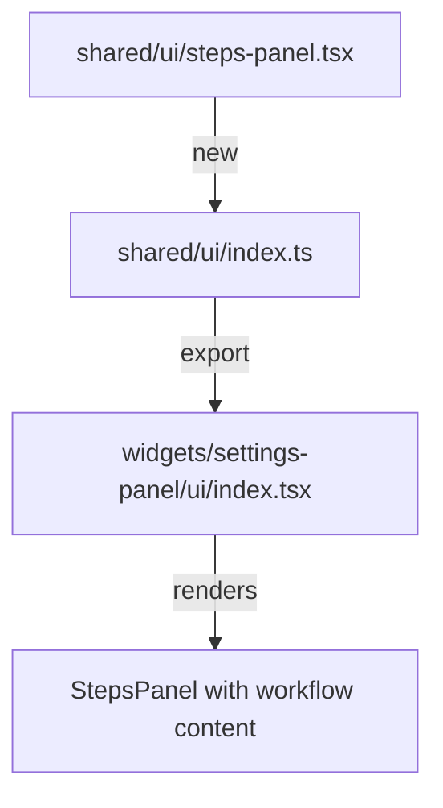

# ADR: Add info panel to Settings page

**Issue:** [STA-6](linear://issue/STA-6)  
**Date:** 2026-03-29  
**Status:** Draft

---

# Architecture Plan: STA-6 — Add info panel to Settings page

## Context

The Settings page currently provides no guidance on the required workflow order: Sync → Map Statuses → Assign Roles. The page layout is managed by `SettingsPanel` widget (see: apps/web/src/widgets/settings-panel/ui/index.tsx:1-39), which renders `PageHeader` followed by three feature cards in sequence.

The codebase already has reusable UI primitives in `shared/ui`: `Card` with subcomponents (see: apps/web/src/shared/ui/card.tsx:1-56), `InfoBadge` for tooltips (see: apps/web/src/shared/ui/info-badge.tsx:1-27), and `InfoRow` for key-value display (see: apps/web/src/shared/ui/info-row.tsx:1-15). These follow a consistent pattern of Tailwind styling with design tokens (`text-muted-foreground`, `border-border`, `bg-card`).

The component is purely presentational with static content—no state, no API calls, no interactivity (collapsing/dismissing is explicitly out of scope). Ownership analysis shows Konstantin Shchegolev owns all affected files (see: CODE OWNERSHIP), minimizing review friction.

## Decision Drivers

- **FSD compliance**: Static presentation components belong in `shared/ui`; feature-specific compositions belong in widgets
- **Reusability**: A numbered-steps panel pattern may be useful elsewhere (onboarding, wizards)
- **Minimal blast radius**: Adding a new file to `shared/ui` affects no existing imports (see: MODULE DEPENDENCIES)
- **Consistency**: Must follow existing styling conventions from `Card` and other shared components

## Considered Options

### Option 1: Widget-local component

Create `WorkflowInfoPanel.tsx` directly inside `widgets/settings-panel/ui/`.

- Keeps Settings-specific content co-located with its only consumer
- **Pros**: Zero impact on shared layer; fast to implement
- **Cons**: Cannot reuse pattern elsewhere; violates FSD (widgets should compose, not define primitives)
- **Effort**: ~3h

### Option 2: Shared UI component with content injection

Create a generic `StepsPanel` component in `shared/ui` that accepts steps as props, then instantiate it in `SettingsPanel` with the specific workflow content.

```tsx
// shared/ui/steps-panel.tsx
type Step = { title: string; description: string };
type StepsPanelProps = { steps: Step[] };
```

- **Pros**: Reusable pattern; follows existing `shared/ui` conventions (see: apps/web/src/shared/ui/card.tsx); clean separation of structure vs. content
- **Cons**: Slightly more abstraction; need to export from shared/ui barrel
- **Effort**: ~4h

### Option 3: New feature slice `features/workflow-info`

Create a dedicated feature slice with its own `ui/index.tsx`.

- **Pros**: Full FSD compliance if component had business logic
- **Cons**: Overkill for static content; features are for user interactions, not static text; adds unnecessary directory structure
- **Effort**: ~5h

## Decision

**We will use Option 2: Shared UI component with content injection**

Rationale:
1. The numbered-steps panel is a generalizable UI pattern (like `Card`), not Settings-specific logic
2. Follows the existing pattern where `Card`, `InfoBadge`, `InfoRow` live in `shared/ui` (see: apps/web/src/shared/ui/) and consumers compose them with content
3. Content (the 3 workflow steps) is defined at the call site in `SettingsPanel`, maintaining widget-level control over what's displayed
4. Keeps the shared component stateless and purely presentational, matching `InfoBadge` design (see: apps/web/src/shared/ui/info-badge.tsx:7-27)

## Consequences

### Positive
- Enables future reuse for onboarding flows or multi-step wizards
- Consistent with existing `shared/ui` structure
- Single point of styling for all step-based panels

### Negative / Trade-offs
- Adds one new file to `shared/ui` (acceptable given existing precedent)
- Generic component requires content to be passed as props (minimal overhead)

### Risks

| Severity | Risk | Mitigation |
|----------|------|------------|
| Low | Design inconsistency with existing cards | Use same Tailwind tokens as `Card` (see: apps/web/src/shared/ui/card.tsx:9-12): `rounded-xl`, `border-border`, `bg-card` |
| Low | Component API changes if interactivity added later | Keep props minimal (`steps: Step[]`); interactivity is explicitly out of scope per AC |

## File Changes



| Action | File | Purpose |
|--------|------|---------|
| Create | `apps/web/src/shared/ui/steps-panel.tsx` | Generic numbered-steps panel component |
| Modify | `apps/web/src/shared/ui/index.ts` | Add `StepsPanel` export |
| Modify | `apps/web/src/widgets/settings-panel/ui/index.tsx` | Import and render `StepsPanel` between `PageHeader` and `ProjectSyncCard` (line 18) |