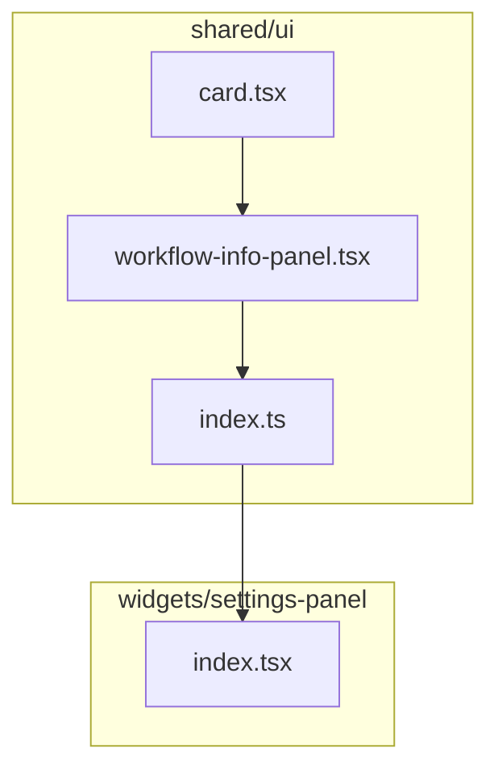

# ADR: Add info panel to Settings page

**Issue:** [STA-6](linear://issue/STA-6)  
**Date:** 2026-03-29  
**Status:** Draft

---

# Architecture Plan: STA-6 — Add info panel to Settings page

## Context

The Settings page (`SettingsPanel` widget) currently renders a `PageHeader` followed by three configuration cards in a specific workflow order: `ProjectSyncCard` → `StatusPhaseMappingCard` → `TeamMappingCard` (see: apps/web/src/widgets/settings-panel/ui/index.tsx:17-37). New users have no guidance on this workflow sequence or what each step accomplishes.

The codebase uses a Feature-Sliced Design structure with shared UI primitives in `@/shared/ui`. The existing `Card` component family (see: apps/web/src/shared/ui/card.tsx:6-14) establishes visual patterns: `rounded-xl border border-border bg-card` with consistent padding via `CardHeader`/`CardContent`. The `PageHeader` component (see: apps/web/src/shared/ui/page-header.tsx:8-15) is purely presentational with no layout concerns.

Complexity is low: `SettingsPanel` has medium complexity with 39 lines (see: complexity analysis), and we're adding a static presentational component between existing elements. Blast radius is minimal — only `SettingsPanel` needs modification to include the new component.

## Decision Drivers

- **Consistency**: Must match existing Card styling patterns to appear native
- **FSD compliance**: Static presentational UI belongs in `shared/ui` layer
- **Simplicity**: No state, no interactivity, pure markup per requirements (out of scope: collapse, dismiss)
- **Single responsibility**: New component handles only workflow explanation, not page layout

## Considered Options

### Option 1: Inline JSX in SettingsPanel

Add the info panel markup directly inside `SettingsPanel` component.

- **Pros**: Fastest implementation, no new files
- **Cons**: Bloats widget with presentational markup; harder to test in isolation; violates FSD separation
- **Effort**: ~2 hours

### Option 2: New `WorkflowInfoPanel` in shared/ui

Create a dedicated `WorkflowInfoPanel` component in `@/shared/ui`, composing existing `Card` primitives.

- **Pros**: Follows FSD pattern; reusable if other pages need similar panels; testable in isolation; consistent with existing `Card`/`PageHeader` approach (see: apps/web/src/shared/ui/card.tsx)
- **Cons**: Slightly more files; component may not be reused
- **Effort**: ~4 hours

### Option 3: Generic `InfoPanel` with steps prop

Create a generic `InfoPanel` component accepting a `steps` array, rendering numbered items.

- **Pros**: Maximum reusability
- **Cons**: Over-engineering for a single use case; requirements explicitly exclude interactivity, suggesting static content
- **Effort**: ~6 hours

## Decision

**We will use Option 2: New `WorkflowInfoPanel` in shared/ui**

Rationale:
1. The codebase already separates presentational primitives into `shared/ui` (see: apps/web/src/shared/ui/card.tsx, apps/web/src/shared/ui/page-header.tsx) — this follows established patterns
2. Composing `Card`, `CardHeader`, `CardContent` ensures visual consistency without duplicating styles
3. The component can be tested independently, matching quality standards implied by the testing subtask
4. If scope changes later (e.g., adding dismiss functionality), isolation makes refactoring safer
5. Single owner (Konstantin Shchegolev) for all affected files simplifies review

## File Structure

```
apps/web/src/shared/ui/
├── workflow-info-panel.tsx   # NEW — WorkflowInfoPanel component
├── index.ts                  # MODIFY — add export
└── card.tsx                  # UNCHANGED — reused primitives

apps/web/src/widgets/settings-panel/ui/
└── index.tsx                 # MODIFY — import and render WorkflowInfoPanel
```



## Component Design

`WorkflowInfoPanel` will:
- Import `Card`, `CardHeader`, `CardTitle`, `CardContent` from local barrel (see: apps/web/src/shared/ui/card.tsx)
- Use a subtle accent background variant (e.g., `bg-muted/50`) to differentiate from interactive cards
- Render an ordered list with semantic `<ol>` for accessibility
- Accept no props — content is static per requirements

Integration in `SettingsPanel` (see: apps/web/src/widgets/settings-panel/ui/index.tsx:20-22):
```tsx
<PageHeader ... />
<WorkflowInfoPanel />        {/* NEW — insert here */}
<div className="max-w-xl">
  <ProjectSyncCard ... />
```

## Consequences

### Positive
- Users immediately see workflow guidance on page load
- Zero runtime overhead (static content, no state)
- Consistent visual language via Card primitives
- Clean separation enables future enhancements (e.g., collapsible variant) without touching widget

### Negative / Trade-offs
- One additional shared component that may remain single-use
- Content is hardcoded; future i18n would require refactoring (but i18n not evidenced in codebase)

### Risks

| Severity | Risk | Mitigation |
|----------|------|------------|
| Low | Panel text becomes outdated if workflow changes | Co-locate comment referencing STA-6; update in same PR as workflow changes |
| Low | Visual inconsistency with Card variants | Use existing Card primitives directly; visual review in subtask 5 |